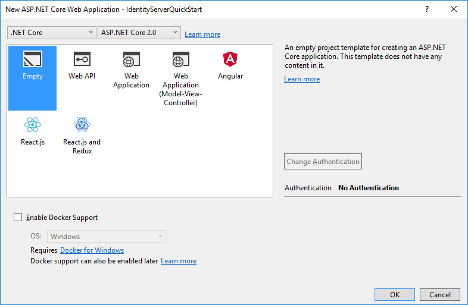
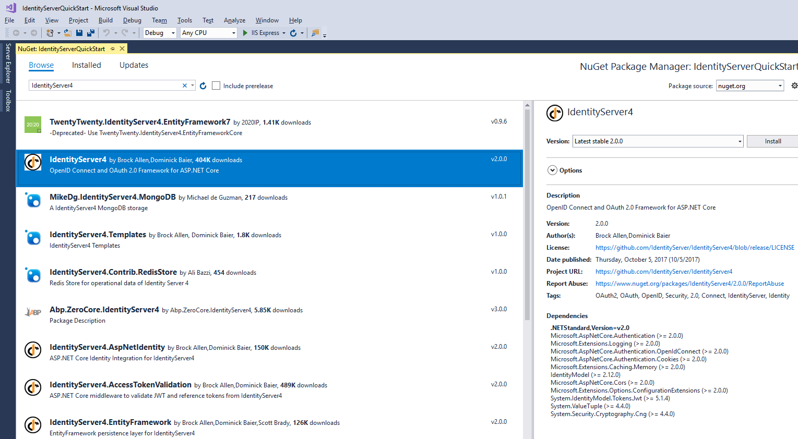
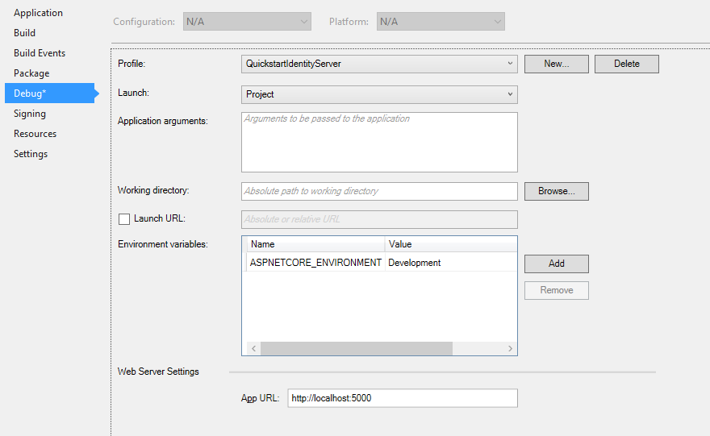

Setup and Overview
==================

There are two fundamental ways to start a new IdentityServer project:

* start from scratch
* start with the ASP.NET Identity template in Visual Studio

If you start from scratch, we provide a couple of helpers and in-memory stores, so 
you don't have to worry about persistence right from the start.

If you start with ASP.NET Identity, we provide an easy way to integrate with that as well.

The quickstarts provide step by step instructions for various common IdentityServer scenarios.
They start with the absolute basics and become more complex - 
it is recommended you do them in order.

Every quickstart has a reference solution - you can find the code in the 
`IdentityServer4.Samples <https://github.com/IdentityServer/IdentityServer4.Samples>`_
repo in the quickstarts folder.

Basic setup
^^^^^^^^^^^
The screen shots show Visual Studio - but this is not a requirement.

**Creating the quickstart IdentityServer**

Start by creating a new ASP.NET Core project.

.. image:: images/0_new_web_project.png

Then select the "Empty" option.

Next, add the `IdentityServer4` nuget package:

    
Alternatively you can use Package Manager Console to add the dependency by running the following command:

    "Install-Package IdentityServer4"

.. note:: IdentityServer build numbers 1.x target ASP.NET Core 1.1, and IdentityServer build numbers 2.x targets ASP.NET Core 2.0 .

IdentityServer uses the usual pattern to configure and add services to an ASP.NET Core host.
In ``ConfigureServices`` the required services are configured and added to the DI system. 
In ``Configure`` the middleware is added to the HTTP pipeline.

Modify your ``Startup.cs`` file to look like this::

    public class Startup
    {
        public void ConfigureServices(IServiceCollection services)
        {
            services.AddIdentityServer()
                .AddDeveloperSigningCredential();
        }

        public void Configure(IApplicationBuilder app, IHostingEnvironment env)
        {
            if (env.IsDevelopment())
            {
                app.UseDeveloperExceptionPage();
            }

            app.UseIdentityServer();
        }
    }

``AddIdentityServer`` registers the IdentityServer services in DI. It also registers an in-memory store for runtime state.
This is useful for development scenarios. For production scenarios you need a persistent or shared store like a database or cache for that.
See the :ref:`EntityFramework <refEntityFrameworkQuickstart>` quickstart for more information.

The ``AddDeveloperSigningCredential`` extension creates temporary key material for signing tokens.
Again this might be useful to get started, but needs to be replaced by some persistent key material for production scenarios.
See the :ref:`cryptography docs <refCrypto>` for more information.

.. Note:: IdentityServer is not yet ready to be launched. We will add the required services in the following quickstarts.

Modify hosting
^^^^^^^^^^^^^^^

By default Visual Studio uses IIS Express to host your web project. This is totally fine,
except that you won't be able to see the real time log output to the console.

IdentityServer makes extensive use of logging whereas the "visible" error message in the UI
or returned to clients are deliberately vague.

We recommend to run IdentityServer in the console host. 
You can do this by switching the launch profile in Visual Studio.
You also don't need to launch a browser every time you start IdentityServer - you can turn that off as well:

In addition, it will be helpful to run IdentityServer on a consistent URL for these quickstarts.
You should also configure this URL in the launch profile dialog above, and use ``http://localhost:5000/``.
In the above screenshot  you can see this URL has been configured.

.. Note:: We recommend to configure the same port for IIS Express and self-hosting. This way you can switch between the two without having to modify any configuration in your clients.

To then choose the console host when you launch, you must select it in the launch menu from Visual Studio:

How to run the quickstart
^^^^^^^^^^^^^^^^^^^^^^^^^
As mentioned above every quickstart has a reference solution - you can find the code in the 
`IdentityServer4.Samples <https://github.com/IdentityServer/IdentityServer4.Samples>`_
repo in the quickstarts folder.

The easiest way to run the individual parts of a quickstart solution is to set the startup mode to "current selection".
Right click the solution and select "Set Startup Projects":

Typically you start IdentityServer first, then the API, and then the client. Only run in the debugger if you actually want to debug.
Otherwise Ctrl+F5 is the best way to run the projects.