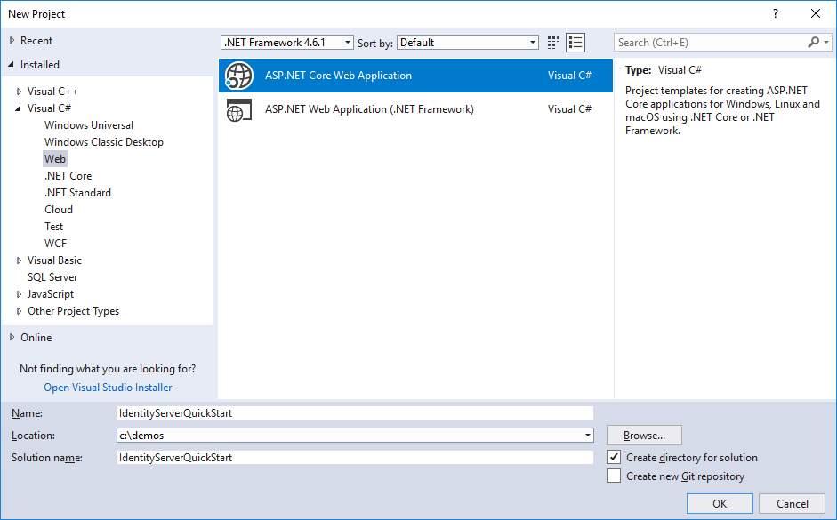

Setup and Overview
==================

There are two fundamental ways to start a new IdentityServer project:

* start from scratch
* start with the ASP.NET Identity template in Visual Studio

If you start from scratch, we provide a couple of helpers and in-memory stores, so 
you don't have to worry about persistence right from the start.

If you start with ASP.NET Identity, we provide an easy way to integrate with that as well.

The quickstarts provide step by step instructions for various common identityserver scenarios.
They start with the absolute basics and become more complex - 
it is recommended you do them in in order.

Every quickstart has a reference solution - you can find the code in the 
`IdentityServer4.Samples <https://github.com/IdentityServer/IdentityServer4.Samples>`_
repo in the quickstarts folder.

Basic setup
^^^^^^^^^^^
The screen shots show Visual Studio - but this is not a requirement.

**Creating the quickstart IdentityServer**

Start by creating a new ASP.NET Core project.

Then select the "Empty Web" option.

.. image:: images/0_empty_web.png

Next, add the IdentityServer4 nuget package by adding the following line to your project.json::

    "IdentityServer4": "1.0.0-rc2"
    
IdentityServer uses the usual pattern to configure and add services to an ASP.NET Core host.
In ``ConfigureServices`` the required services are configured and added to the DI system. 
In ``Configure`` the middleware is added to the HTTP pipeline.

Modify your ``Startup.cs`` file to look like this::

    public class Startup
    {
        public void ConfigureServices(IServiceCollection services)
        {
            services.AddDeveloperIdentityServer();
        }

        public void Configure(IApplicationBuilder app, ILoggerFactory loggerFactory)
        {
            loggerFactory.AddConsole(LogLevel.Debug);
            app.UseDeveloperExceptionPage();

            app.UseIdentityServer();
        }
    }

``AddDeveloperIdentityServer`` is a convenient way to quickly setup IdentityServer with
in-memory keys and data stores. This is only useful for development and test scenarios. 

For real deployments you would rather use keys loaded from a secured location,
as well as persistent backing stores.
But as the name says, this allows you to get quickly started.

Modify hosting
^^^^^^^^^^^^^^^

By default Visual Studio uses IIS Express to host your web project. This is totally fine,
besides that you won't be able to see the real time log output to the console.

IdentityServer makes extensive use of logging whereas the "visible" error message in the UI
or returned to clients are deliberately vague.

We recommend to run IdentityServer in the console host. 
You can do this by switching the launch profile in Visual Studio.
You also don't need to launch a browser every time you start IdentityServer - you can turn that off as well:

.. image:: images/0_launch_profile.png

When you switch to self-hosting, the web server port defaults to 5000. 
You can configure this in ``Program.cs`` - 
we use the following configuration for the IdentityServer host in the quickstarts::

    public class Program
    {
        public static void Main(string[] args)
        {
            Console.Title = "IdentityServer";

            var host = new WebHostBuilder()
                .UseKestrel()
                .UseUrls("http://localhost:5000")
                .UseContentRoot(Directory.GetCurrentDirectory())
                .UseIISIntegration()
                .UseStartup<Startup>()
                .Build();

            host.Run();
        }
    }

.. Note:: We recommend to configure the same port for IIS Express and self-hosting. This way you can switch between the two without having to modify any configuration in your clients.