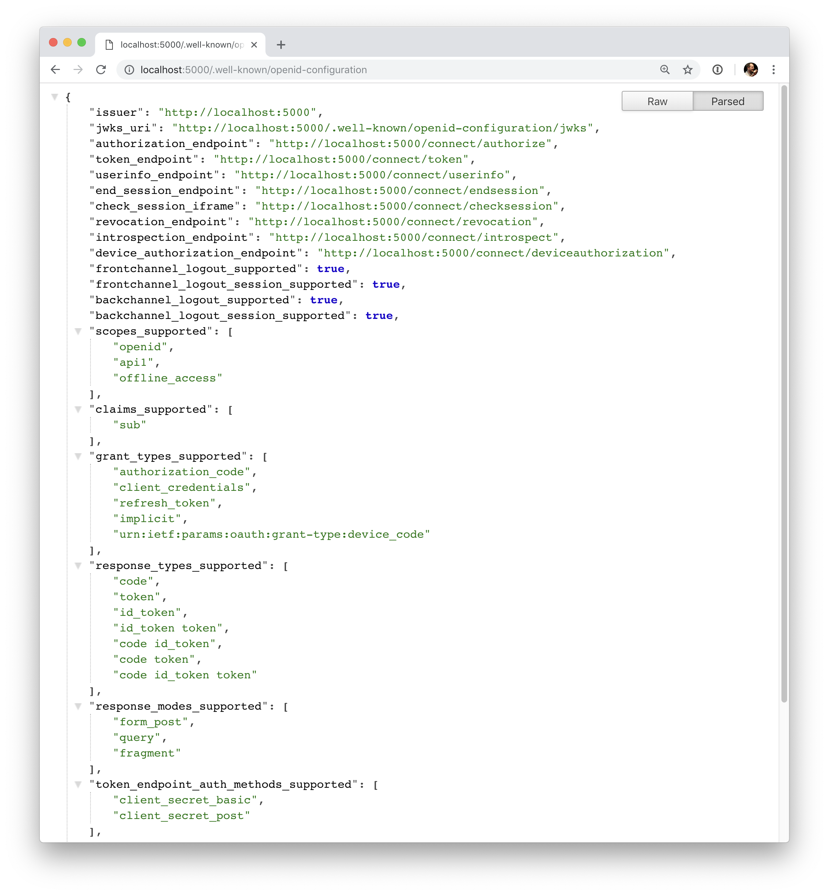
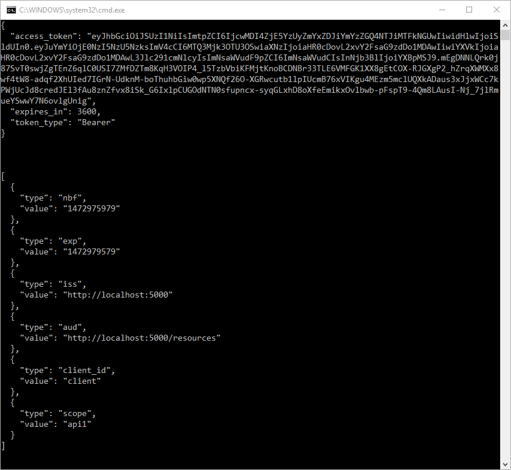

.. _refClientCredentialsQuickstart:

Protecting an API using Client Credentials
==========================================
The following Identity Server 4 quickstart provides step by step instructions for various common IdentityServer scenarios. 
These start with the absolute basics and become more complex as they progress. We recommend that you follow them in sequence.  

To see the full list, please go to `IdentityServer4 Quickstarts Overview <https://identityserver4.readthedocs.io/en/latest/quickstarts/0_overview.html>`_

This first quickstart is the most basic scenario for protecting APIs using IdentityServer. 
In this quickstart you define an API and a Client with which to access it. 
The client will request an access token from the Identity Server using its client ID and secret and then use the token to gain access to the API.

Source Code
^^^^^^^^^^^
As with all of these quickstarts you can find the source code for it in the `IdentityServer4 <https://github.com/IdentityServer/IdentityServer4/blob/main/samples>`_ repository. The project for this quickstart is `Quickstart #1: Securing an API using Client Credentials <https://github.com/IdentityServer/IdentityServer4/tree/main/samples/Quickstarts/1_ClientCredentials>`_

Preparation
^^^^^^^^^^^
The IdentityServer templates for the dotnet CLI are a good starting point for the quickstarts.
To install the templates open a console window and type the following command::

    dotnet new -i IdentityServer4.Templates

They will be used as a starting point for the various tutorials.

Setting up the ASP.NET Core application
^^^^^^^^^^^^^^^^^^^^^^^^^^^^^^^^^^^^^^^
First create a directory for the application - then use our template to create an ASP.NET Core application that includes a basic IdentityServer setup, e.g.::

    md quickstart
    cd quickstart

    md src
    cd src

    dotnet new is4empty -n IdentityServer

This will create the following files:

* ``IdentityServer.csproj`` - the project file and a ``Properties\launchSettings.json`` file
* ``Program.cs`` and ``Startup.cs`` - the main application entry point
* ``Config.cs`` - IdentityServer resources and clients configuration file

You can now use your favorite text editor to edit or view the files. If you want to have Visual Studio support, you can add a solution file like this::

    cd ..
    dotnet new sln -n Quickstart

and let it add your IdentityServer project (keep this command in mind as we will create other projects below)::

    dotnet sln add .\src\IdentityServer\IdentityServer.csproj

.. note:: The protocol used in this Template is ``https`` and the port is set to 5001 when running on Kestrel or a random one on IISExpress. You can change that in the ``Properties\launchSettings.json`` file. For production scenarios you should always use ``https``.

Defining an API Scope
^^^^^^^^^^^^^^^^^^^^^
An API is a resource in your system that you want to protect. 
Resource definitions can be loaded in many ways, the template you used to create the project above shows how to use a "code as configuration" approach.

The Config.cs is already created for you. Open it, update the code to look like this::

    public static class Config
    {
        public static IEnumerable<ApiScope> ApiScopes =>
            new List<ApiScope>
            {
                new ApiScope("api1", "My API")
            };
    }

(see the full file `here <https://github.com/IdentityServer/IdentityServer4/blob/main/samples/Quickstarts/1_ClientCredentials/src/IdentityServer/Config.cs>`_).
	
.. note:: If you will be using this in production it is important to give your API a logical name. Developers will be using this to connect to your api though your Identity server.  It should describe your api in simple terms to both developers and users.

Defining the client
^^^^^^^^^^^^^^^^^^^
The next step is to define a client application that we will use to access our new API.

For this scenario, the client will not have an interactive user, and will authenticate using the so called client secret with IdentityServer.

For this, add a client definition:: 

    public static IEnumerable<Client> Clients =>
        new List<Client>
        {
            new Client
            {
                ClientId = "client",

                // no interactive user, use the clientid/secret for authentication
                AllowedGrantTypes = GrantTypes.ClientCredentials,

                // secret for authentication
                ClientSecrets =
                {
                    new Secret("secret".Sha256())
                },

                // scopes that client has access to
                AllowedScopes = { "api1" }
            }
        };

You can think of the ClientId and the ClientSecret as the login and password for your application itself.  
It identifies your application to the identity server so that it knows which application is trying to connect to it.	

	
Configuring IdentityServer
^^^^^^^^^^^^^^^^^^^^^^^^^^
Loading the resource and client definitions happens in `Startup.cs <https://github.com/IdentityServer/IdentityServer4/blob/main/samples/Quickstarts/1_ClientCredentials/src/IdentityServer/Startup.cs>`_ - update the code to look like this::

    public void ConfigureServices(IServiceCollection services)
    {
        var builder = services.AddIdentityServer()
            .AddInMemoryApiScopes(Config.ApiScopes)
            .AddInMemoryClients(Config.Clients);

        // omitted for brevity
    }

That's it - your identity server should now be configured. If you run the server and navigate the browser to ``https://localhost:5001/.well-known/openid-configuration``, you should see the so-called discovery document. 
The discovery document is a standard endpoint in identity servers.  The discovery document will be used by your clients and APIs to download the necessary configuration data.

At first startup, IdentityServer will create a developer signing key for you, it's a file called ``tempkey.jwk``.
You don't have to check that file into your source control, it will be re-created if it is not present.

Adding an API
^^^^^^^^^^^^^
Next, add an API to your solution. 

You can either use the ASP.NET Core Web API template from Visual Studio or use the .NET CLI to create the API project as we do here.
Run from within the ``src`` folder the following command::

    dotnet new webapi -n Api

Then add it to the solution by running the following commands::

    cd ..
    dotnet sln add .\src\Api\Api.csproj

Configure the API application to run on ``https://localhost:6001`` only. You can do this by editing the `launchSettings.json <https://github.com/IdentityServer/IdentityServer4/blob/main/samples/Quickstarts/1_ClientCredentials/src/Api/Properties/launchSettings.json>`_ file inside the Properties folder. Change the application URL setting to be::

    "applicationUrl": "https://localhost:6001"

The controller
--------------
Add a new class called ``IdentityController``::

    [Route("identity")]
    [Authorize]
    public class IdentityController : ControllerBase
    {
        [HttpGet]
        public IActionResult Get()
        {
            return new JsonResult(from c in User.Claims select new { c.Type, c.Value });
        }
    }

This controller will be used later to test the authorization requirement, as well as visualize the claims identity through the eyes of the API.

Adding a Nuget Dependency
-------------------------
In order for the configuration step to work the nuget package dependency has to be added, run this command in the root directory::

    dotnet add .\\src\\api\\Api.csproj package Microsoft.AspNetCore.Authentication.JwtBearer

Configuration
-------------
The last step is to add the authentication services to DI (dependency injection) and the authentication middleware to the pipeline.
These will:

* validate the incoming token to make sure it is coming from a trusted issuer
* validate that the token is valid to be used with this api (aka audience)

Update `Startup` to look like this::

    public class Startup
    {
        public void ConfigureServices(IServiceCollection services)
        {
            services.AddControllers();

            services.AddAuthentication("Bearer")
                .AddJwtBearer("Bearer", options =>
                {
                    options.Authority = "https://localhost:5001";

                    options.TokenValidationParameters = new TokenValidationParameters
                    {
                        ValidateAudience = false
                    };
                });
        }

        public void Configure(IApplicationBuilder app)
        {
            app.UseRouting();

            app.UseAuthentication();
            app.UseAuthorization();

            app.UseEndpoints(endpoints =>
            {
                endpoints.MapControllers();
            });
        }
    }

* ``AddAuthentication`` adds the authentication services to DI and configures ``Bearer`` as the default scheme. 
* ``UseAuthentication`` adds the authentication middleware to the pipeline so authentication will be performed automatically on every call into the host.
* ``UseAuthorization`` adds the authorization middleware to make sure, our API endpoint cannot be accessed by anonymous clients.

Navigating to the controller ``https://localhost:6001/identity`` on a browser should return a 401 status code. 
This means your API requires a credential and is now protected by IdentityServer.

.. note:: If you are wondering, why the above code disables audience validation, have a look :ref:`here <refResources>` for a more in-depth discussion.

Creating the client
^^^^^^^^^^^^^^^^^^^
The last step is to write a client that requests an access token, and then uses this token to access the API. For that, add a console project to your solution, remember to create it in the ``src``::

    dotnet new console -n Client
    
Then as before, add it to your solution using::

    cd ..
    dotnet sln add .\src\Client\Client.csproj

The token endpoint at IdentityServer implements the OAuth 2.0 protocol, and you could use raw HTTP to access it. 
However, we have a client library called IdentityModel, that encapsulates the protocol interaction in an easy to use API.

Add the ``IdentityModel`` NuGet package to your client. 
This can be done either via Visual Studio's Nuget Package manager or dotnet CLI::

    cd src
    cd client
    dotnet add package IdentityModel

IdentityModel includes a client library to use with the discovery endpoint. This way you only need to know the base-address of IdentityServer - the actual endpoint addresses can be read from the metadata::

    // discover endpoints from metadata
    var client = new HttpClient();
    var disco = await client.GetDiscoveryDocumentAsync("https://localhost:5001");
    if (disco.IsError)
    {
        Console.WriteLine(disco.Error);
        return;
    }
.. note:: If you get an error connecting it may be that you are running `https` and the development certificate for ``localhost`` is not trusted. You can run ``dotnet dev-certs https --trust`` in order to trust the development certificate. This only needs to be done once.

Next you can use the information from the discovery document to request a token to IdentityServer to access ``api1``::

    // request token
    var tokenResponse = await client.RequestClientCredentialsTokenAsync(new ClientCredentialsTokenRequest
    {
        Address = disco.TokenEndpoint,

        ClientId = "client",
        ClientSecret = "secret",
        Scope = "api1"
    });
    
    if (tokenResponse.IsError)
    {
        Console.WriteLine(tokenResponse.Error);
        return;
    }

    Console.WriteLine(tokenResponse.Json);

(full file can be found `here <https://github.com/IdentityServer/IdentityServer4/blob/main/samples/Quickstarts/1_ClientCredentials/src/Client/Program.cs>`_)

.. note:: Copy and paste the access token from the console to `jwt.ms <https://jwt.ms>`_ to inspect the raw token.

Calling the API
^^^^^^^^^^^^^^^
To send the access token to the API you typically use the HTTP Authorization header. This is done using the ``SetBearerToken`` extension method::

    // call api
    var apiClient = new HttpClient();
    apiClient.SetBearerToken(tokenResponse.AccessToken);

    var response = await apiClient.GetAsync("https://localhost:6001/identity");
    if (!response.IsSuccessStatusCode)
    {
        Console.WriteLine(response.StatusCode);
    }
    else
    {
        var content = await response.Content.ReadAsStringAsync();
        Console.WriteLine(JArray.Parse(content));
    }

(If you are in Visual Studio you can right-click on the solution and select "Multiple Startup Projects", and ensure the Api and IdentityServer will start; then run the solution; then, to step through the Client code, you can right-click on the "Client" project and select Debug... Start New Instance).
The output should look like this:

.. note:: By default an access token will contain claims about the scope, lifetime (nbf and exp), the client ID (client_id) and the issuer name (iss).

Authorization at the API
^^^^^^^^^^^^^^^^^^^^^^^^
Right now, the API accepts any access token issued by your identity server.

In the following we will add code that allows checking for the presence of the scope in the access token that the client asked for (and got granted).
For this we will use the ASP.NET Core authorization policy system. Add the following to the ``ConfigureServices`` method in ``Startup``::

    services.AddAuthorization(options =>
    {
        options.AddPolicy("ApiScope", policy =>
        {
            policy.RequireAuthenticatedUser();
            policy.RequireClaim("scope", "api1");
        });
    });

You can now enforce this policy at various levels, e.g.

* globally
* for all API endpoints
* for specific controllers/actions

Typically you setup the policy for all API endpoints in the routing system::

    app.UseEndpoints(endpoints =>
    {
        endpoints.MapControllers()
            .RequireAuthorization("ApiScope");
    });

Further experiments
^^^^^^^^^^^^^^^^^^^
This walkthrough focused on the success path so far

* client was able to request token
* client could use the token to access the API

You can now try to provoke errors to learn how the system behaves, e.g.

* try to connect to IdentityServer when it is not running (unavailable)
* try to use an invalid client id or secret to request the token
* try to ask for an invalid scope during the token request
* try to call the API when it is not running (unavailable)
* don't send the token to the API
* configure the API to require a different scope than the one in the token
