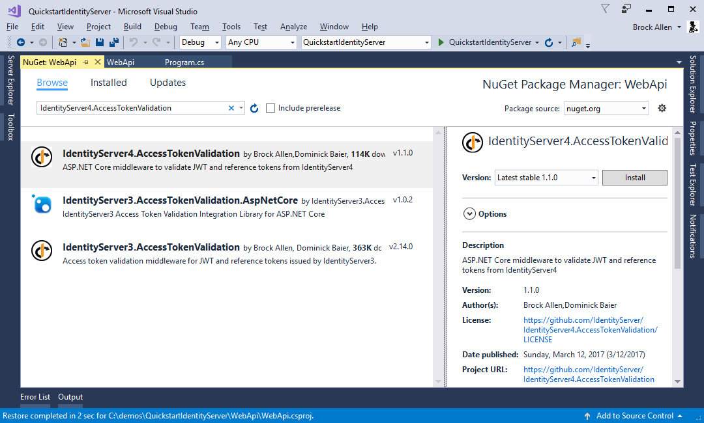
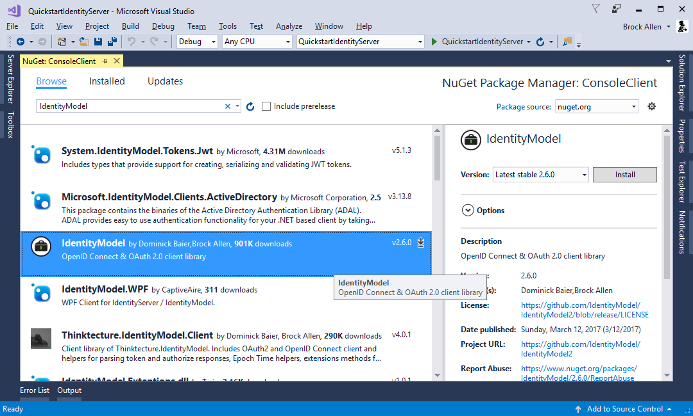

.. _refClientCredentialsQuickstart:
Protecting an API using Client Credentials
==========================================

This quickstart presents the most basic scenario for protecting APIs using IdentityServer.

In this scenario we will define an API and a client that wants to access it.
The client will request an access token at IdentityServer and use it to gain access to the API.

Defining the API
^^^^^^^^^^^^^^^^
Scopes define the resources in your system that you want to protect, e.g. APIs.

Since we are using the in-memory configuration for this walkthrough - all you need to do 
to add an API, is to create an object of type ``ApiResource`` and set the appropriate properties.

Add a file (e.g. ``Config.cs``) into your project and add the following code::

    public static IEnumerable<ApiResource> GetApiResources()
    {
        return new List<ApiResource>
        {
            new ApiResource("api1", "My API")
        };
    }

Defining the client
^^^^^^^^^^^^^^^^^^^
The next step is to define a client that can access this API.

For this scenario, the client will not have an interactive user, and will authenticate
using the so called client secret with IdentityServer.
Add the following code to your `Config.cs` file::

    public static IEnumerable<Client> GetClients()
    {
        return new List<Client>
        {
            new Client
            {
                ClientId = "client",

                // no interactive user, use the clientid/secret for authentication
                AllowedGrantTypes = GrantTypes.ClientCredentials,

                // secret for authentication
                ClientSecrets =
                {
                    new Secret("secret".Sha256())
                },

                // scopes that client has access to
                AllowedScopes = { "api1" }
            }
        };
    }

Configure IdentityServer
^^^^^^^^^^^^^^^^^^^^^^^^
To configure IdentityServer to use your scopes and client definition, you need to add code
to the ``ConfigureServices`` method. 
You can use convenient extension methods for that - 
under the covers these add the relevant stores and data into the DI system::

    public void ConfigureServices(IServiceCollection services)
    {
        // configure identity server with in-memory stores, keys, clients and resources
        services.AddIdentityServer()
            .AddDeveloperSigningCredential()
            .AddInMemoryApiResources(Config.GetApiResources())
            .AddInMemoryClients(Config.GetClients());
    }

That's it - if you run the server and navigate the browser to 
``http://localhost:5000/.well-known/openid-configuration``, you should see the so-called
discovery document. 
This will be used by your clients and APIs to download the necessary configuration data.

.. image:: images/1_discovery.png

Adding an API
^^^^^^^^^^^^^
Next, add an API to your solution. 

You can use the ASP.NET Core Web API template.
Again, we recommend you take control over the ports and use the same technique as you used
to configure Kestrel and the launch profile as before.
This walkthrough assumes you have configured your API to run on ``http://localhost:5001``.

**The controller**

Add a new controller to your API project::

    [Route("identity")]
    [Authorize]
    public class IdentityController : ControllerBase
    {
        [HttpGet]
        public IActionResult Get()
        {
            return new JsonResult(from c in User.Claims select new { c.Type, c.Value });
        }
    }

This controller will be used later to test the authorization requirement, as well
as visualize the claims identity through the eyes of the API.

**Configuration**

The last step is to add the authentication services to DI and the authentication middleware to the pipeline.
These will:

* validate the incoming token to make sure it is coming from a trusted issuer
* validate that the token is valid to be used with this api (aka scope)

Add the `IdentityServer4.AccessTokenValidation` NuGet package to your project.

Update `Startup` to look like this::

    public class Startup
    {
        public void ConfigureServices(IServiceCollection services)
        {
            services.AddMvcCore()
                .AddAuthorization()
                .AddJsonFormatters();

            services.AddAuthentication("Bearer")
                .AddIdentityServerAuthentication(options =>
                {
                    options.Authority = "http://localhost:5000";
                    options.RequireHttpsMetadata = false;

                    options.ApiName = "api1";
                });
        }

        public void Configure(IApplicationBuilder app)
        {
            app.UseAuthentication();

            app.UseMvc();
        }
    }

``AddAuthentication`` adds the authentication services to DI and configures ``"Bearer"`` as the default scheme.
``AddIdentityServerAuthentication`` adds the IdentityServer access token validation handler into DI for use by the authentication services.
``UseAuthentication`` adds the authentication middleware to the pipeline so authentication will be performed automatically on every call into the host.

If you use the browser to navigate to the controller (``http://localhost:5001/identity``), 
you should get a 401 status code in return. This means your API requires a credential.

That's it, the API is now protected by IdentityServer.

Creating the client
^^^^^^^^^^^^^^^^^^^
The last step is to write a client that requests an access token, and then uses this
token to access the API. For that, add a console project to your solution (see full code `here <https://github.com/IdentityServer/IdentityServer4.Samples/blob/master/Quickstarts/1_ClientCredentials/src/Client/Program.cs>`_).

The token endpoint at IdentityServer implements the OAuth 2.0 protocol, and you could use 
raw HTTP to access it. However, we have a client library called IdentityModel, that
encapsulates the protocol interaction in an easy to use API.

Add the `IdentityModel` NuGet package to your application.

IdentityModel includes a client library to use with the discovery endpoint.
This way you only need to know the base-address of IdentityServer - the actual
endpoint addresses can be read from the metadata::

    // discover endpoints from metadata
    var disco = await DiscoveryClient.GetAsync("http://localhost:5000");
    if (disco.IsError)
    {
        Console.WriteLine(disco.Error);
        return;
    }

Next you can use the ``TokenClient`` class to request the token.
To create an instance you need to pass in the token endpoint address, client id and secret.

Next you can use the ``RequestClientCredentialsAsync`` method to request a token for your API::

    // request token
    var tokenClient = new TokenClient(disco.TokenEndpoint, "client", "secret");
    var tokenResponse = await tokenClient.RequestClientCredentialsAsync("api1");

    if (tokenResponse.IsError)
    {
        Console.WriteLine(tokenResponse.Error);
        return;
    }

    Console.WriteLine(tokenResponse.Json);

.. note:: Copy and paste the access token from the console to `jwt.io <https://jwt.io>`_ to inspect the raw token.

The last step is now to call the API.

To send the access token to the API you typically use the HTTP Authorization header.
This is done using the ``SetBearerToken`` extension method::

    // call api
    var client = new HttpClient();
    client.SetBearerToken(tokenResponse.AccessToken);

    var response = await client.GetAsync("http://localhost:5001/identity");
    if (!response.IsSuccessStatusCode)
    {
        Console.WriteLine(response.StatusCode);
    }
    else
    {
        var content = await response.Content.ReadAsStringAsync();
        Console.WriteLine(JArray.Parse(content));
    }

The output should look like this:

.. image:: images/1_client_screenshot.png

.. note:: By default an access token will contain claims about the scope, lifetime (nbf and exp), the client ID (client_id) and the issuer name (iss).

Further experiments
^^^^^^^^^^^^^^^^^^^

This walkthrough focused on the success path so far

* client was able to request token
* client could use the token to access the API

You can now try to provoke errors to learn how the system behaves, e.g.

* try to connect to IdentityServer when it is not running (unavailable)
* try to use an invalid client id or secret to request the token
* try to ask for an invalid scope during the token request
* try to call the API when it is not running (unavailable)
* don't send the token to the API
* configure the API to require a different scope than the one in the token
