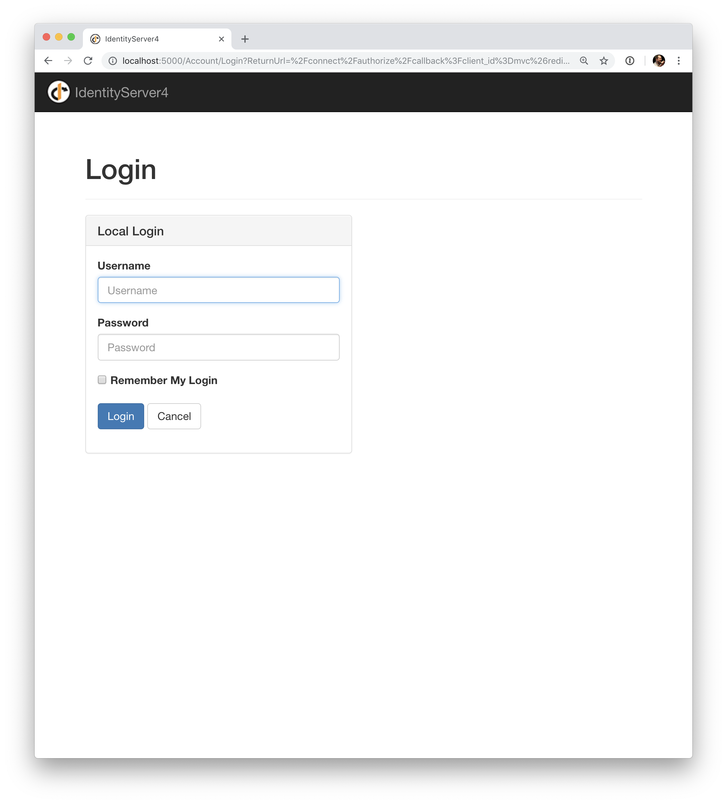
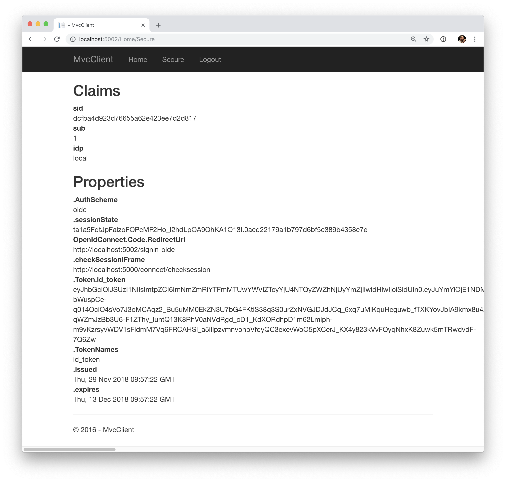
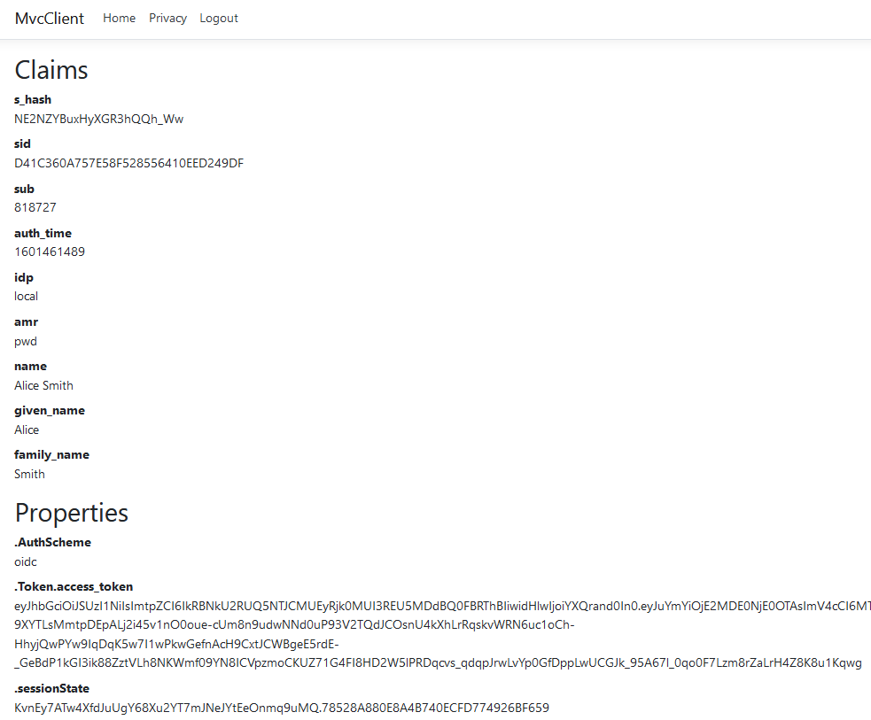
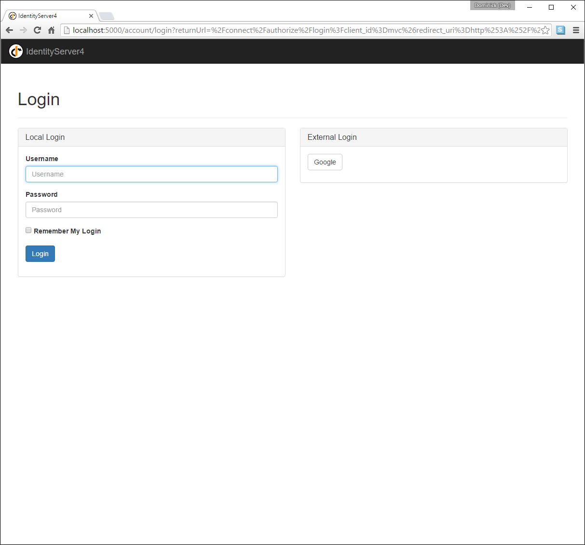

.. _refInteractiveQuickstart:
Interactive Applications with ASP.NET Core
==========================================

.. note:: For any pre-requisites (like e.g. templates) have a look at the :ref:`overview <refQuickstartOverview>` first.

In this quickstart we want to add support for interactive user authentication via the
OpenID Connect protocol to our IdentityServer we built in the previous chapter.

Once that is in place, we will create an MVC application that will use IdentityServer for 
authentication.

Adding the UI
^^^^^^^^^^^^^
All the protocol support needed for OpenID Connect is already built into IdentityServer.
You need to provide the necessary UI parts for login, logout, consent and error.

While the look & feel as well as the exact workflows will probably always differ in every
IdentityServer implementation, we provide an MVC-based sample UI that you can use as a starting point.

This UI can be found in the `Quickstart UI repo <https://github.com/IdentityServer/IdentityServer4.Quickstart.UI/tree/main>`_.
You can clone or download this repo and drop the controllers, views, models and CSS into your IdentityServer web application.

Alternatively you can use the .NET CLI (run from within the ``src/IdentityServer`` folder)::

    dotnet new is4ui

Once you have added the MVC UI, you will also need to enable MVC, both in the DI system and in the pipeline.
When you look at ``Startup.cs`` you will find comments in the ``ConfigureServices`` and ``Configure`` method that tell you how to enable MVC.

.. note:: There is also a template called ``is4inmem`` which combines a basic IdentityServer including the standard UI.

Run the IdentityServer application, you should now see a home page.

Spend some time inspecting the controllers and models - especially the ``AccountController`` which is the main UI entry point.
The better you understand them, the easier it will be to make future modifications. 
Most of the code lives in the "Quickstart" folder using a "feature folder" style. 
If this style doesn't suit you, feel free to organize the code in any way you want.

Creating an MVC client
^^^^^^^^^^^^^^^^^^^^^^
Next you will create an MVC application.
Use the ASP.NET Core "Web Application" (i.e. MVC) template for that. 

run from the src folder::

    dotnet new mvc -n MvcClient
    cd ..
    dotnet sln add .\src\MvcClient\MvcClient.csproj

.. note:: We recommend using the self-host option over IIS Express. The rest of the docs assume you are using self-hosting on port 5002.

To add support for OpenID Connect authentication to the MVC application, you first need to add the nuget package containing the OpenID Connect handler to your project, e.g.::

    dotnet add package Microsoft.AspNetCore.Authentication.OpenIdConnect

..then add the following to ``ConfigureServices`` in ``Startup``::

    using System.IdentityModel.Tokens.Jwt;
    
    // ...
    
    JwtSecurityTokenHandler.DefaultMapInboundClaims = false;

    services.AddAuthentication(options =>
        {
            options.DefaultScheme = "Cookies";
            options.DefaultChallengeScheme = "oidc";
        })
        .AddCookie("Cookies")
        .AddOpenIdConnect("oidc", options =>
        {
            options.Authority = "https://localhost:5001";

            options.ClientId = "mvc";
            options.ClientSecret = "secret";
            options.ResponseType = "code";

            options.SaveTokens = true;
        });

``AddAuthentication`` adds the authentication services to DI.

We are using a cookie to locally sign-in the user (via ``"Cookies"`` as the ``DefaultScheme``),
and we set the ``DefaultChallengeScheme`` to ``oidc`` because when we need the user to login, we will be using the OpenID Connect protocol.

We then use ``AddCookie`` to add the handler that can process cookies.

Finally, ``AddOpenIdConnect`` is used to configure the handler that performs the OpenID Connect protocol.
The ``Authority`` indicates where the trusted token service is located.
We then identify this client via the ``ClientId`` and the ``ClientSecret``. 
``SaveTokens`` is used to persist the tokens from IdentityServer in the cookie (as they will be needed later).

.. note:: We use the so called ``authorization code`` flow with PKCE to connect to the OpenID Connect provider. See :ref:`here <refGrantTypes>` for more information on protocol flows.

And then to ensure the execution of the authentication services on each request, add ``UseAuthentication`` to ``Configure`` in ``Startup``::

    app.UseStaticFiles();

    app.UseRouting();
    app.UseAuthentication();
    app.UseAuthorization();

    app.UseEndpoints(endpoints =>
    {
        endpoints.MapDefaultControllerRoute()
            .RequireAuthorization();
    });

.. note:: The ``RequireAuthorization`` method disables anonymous access for the entire application. 
You can also use the ``[Authorize]`` attribute, if you want to specify authorization on a per controller or action method basis.

Also modify the home view to display the claims of the user as well as the cookie properties::

    @using Microsoft.AspNetCore.Authentication

    <h2>Claims</h2>

    <dl>
        @foreach (var claim in User.Claims)
        {
            <dt>@claim.Type</dt>
            <dd>@claim.Value</dd>
        }
    </dl>

    <h2>Properties</h2>

    <dl>
        @foreach (var prop in (await Context.AuthenticateAsync()).Properties.Items)
        {
            <dt>@prop.Key</dt>
            <dd>@prop.Value</dd>
        }
    </dl>

If you now navigate to the application using the browser, a redirect attempt will be made
to IdentityServer - this will result in an error because the MVC client is not registered yet.

Adding support for OpenID Connect Identity Scopes
^^^^^^^^^^^^^^^^^^^^^^^^^^^^^^^^^^^^^^^^^^^^^^^^^
Similar to OAuth 2.0, OpenID Connect also uses the scopes concept.
Again, scopes represent something you want to protect and that clients want to access.
In contrast to OAuth, scopes in OIDC don't represent APIs, but identity data like user id, 
name or email address.

Add support for the standard ``openid`` (subject id) and ``profile`` (first name, last name etc..) scopes
by amending the ``IdentityResources`` property in ``Config.cs``::

    public static IEnumerable<IdentityResource> IdentityResources =>
        new List<IdentityResource>
        {
            new IdentityResources.OpenId(),
            new IdentityResources.Profile(),
        };

Register the identity resources with IdentityServer in ``startup.cs``::

    var builder = services.AddIdentityServer()
        .AddInMemoryIdentityResources(Config.IdentityResources)
        .AddInMemoryApiScopes(Config.ApiScopes)
        .AddInMemoryClients(Config.Clients);

.. note:: All standard scopes and their corresponding claims can be found in the OpenID Connect `specification <https://openid.net/specs/openid-connect-core-1_0.html#ScopeClaims>`_

Adding Test Users
^^^^^^^^^^^^^^^^^
The sample UI also comes with an in-memory "user database". You can enable this in IdentityServer by adding the ``AddTestUsers`` extension method::

    var builder = services.AddIdentityServer()
        .AddInMemoryIdentityResources(Config.IdentityResources)
        .AddInMemoryApiScopes(Config.ApiScopes)
        .AddInMemoryClients(Config.Clients)
        .AddTestUsers(TestUsers.Users);

When you navigate to the ``TestUsers`` class, you can see that two users called ``alice`` and ``bob`` as well as some identity claims are defined.
You can use those users to login.

Adding the MVC Client to the IdentityServer Configuration
^^^^^^^^^^^^^^^^^^^^^^^^^^^^^^^^^^^^^^^^^^^^^^^^^^^^^^^^^
The last step is to add a new configuration entry for the MVC client to the IdentityServer.

OpenID Connect-based clients are very similar to the OAuth 2.0 clients we added so far.
But since the flows in OIDC are always interactive, we need to add some redirect URLs to our configuration.

The client list should look like this::

    public static IEnumerable<Client> Clients =>
        new List<Client>
        {
            // machine to machine client (from quickstart 1)
            new Client
            {
                ClientId = "client",
                ClientSecrets = { new Secret("secret".Sha256()) },

                AllowedGrantTypes = GrantTypes.ClientCredentials,
                // scopes that client has access to
                AllowedScopes = { "api1" }
            },
            // interactive ASP.NET Core MVC client
            new Client
            {
                ClientId = "mvc",
                ClientSecrets = { new Secret("secret".Sha256()) },

                AllowedGrantTypes = GrantTypes.Code,
                
                // where to redirect to after login
                RedirectUris = { "https://localhost:5002/signin-oidc" },

                // where to redirect to after logout
                PostLogoutRedirectUris = { "https://localhost:5002/signout-callback-oidc" },

                AllowedScopes = new List<string>
                {
                    IdentityServerConstants.StandardScopes.OpenId,
                    IdentityServerConstants.StandardScopes.Profile
                }
            }
        };

Testing the client
^^^^^^^^^^^^^^^^^^
Now finally everything should be in place for the new MVC client.

Trigger the authentication handshake by navigating to the protected controller action.
You should see a redirect to the login page of the IdentityServer.

After that, the IdentityServer will redirect back to the MVC client, where the OpenID Connect authentication handler processes the response and signs-in the user locally by setting a cookie.
Finally the MVC view will show the contents of the cookie.

As you can see, the cookie has two parts, the claims of the user, and some metadata. This metadata also contains the original token that was issued by the IdentityServer.
Feel free to copy this token to `jwt.ms <https://jwt.ms>`_ to inspect its content.

Adding sign-out
^^^^^^^^^^^^^^^
The very last step is to add sign-out to the MVC client.

With an authentication service like IdentityServer, it is not enough to clear the local application cookies.
In addition you also need to make a roundtrip to the IdentityServer to clear the central single sign-on session.

The exact protocol steps are implemented inside the OpenID Connect handler, 
simply add the following code to some controller to trigger the sign-out::

    public IActionResult Logout()
    {
        return SignOut("Cookies", "oidc");
    }

This will clear the local cookie and then redirect to the IdentityServer.
The IdentityServer will clear its cookies and then give the user a link to return back to the MVC application.

Getting claims from the UserInfo endpoint
^^^^^^^^^^^^^^^
You might have noticed that even though we've configured the client to be allowed to retrieve the ``profile`` identity scope, the claims associated with that scope (such as ``name``, ``family_name``, ``website`` etc.) don't appear in the returned token. We need to tell the client to pull remaining claims from the `UserInfo <https://identityserver4.readthedocs.io/en/latest/endpoints/userinfo.html>`_ endpoint by specifying scopes that the client application needs to access and setting the ``GetClaimsFromUserInfoEndpoint`` option. In the following example we're requesting the ``profile`` scope, but it could be any scope (or scopes) that the client is authorized to access::

    .AddOpenIdConnect("oidc", options =>
    {
        // ...
        options.Scope.Add("profile");
        options.GetClaimsFromUserInfoEndpoint = true;
        // ...
    });

After restarting the client app, logging out, and logging back in you should see additional user claims associated with the ``profile`` identity scope displayed on the page.

Further Experiments
^^^^^^^^^^^^^^^^^^^
Feel free to add more claims to the test users - and also more identity resources. 

The process for defining an identity resource is as follows:

* add a new identity resource to the list - give it a name and specify which claims should be returned when this resource is requested
* give the client access to the resource via the ``AllowedScopes`` property on the client configuration
* request the resource by adding it to the ``Scopes`` collection on the OpenID Connect handler configuration in the client
* (optional) if the identity resource is associated with a non-standard claim (e.g. ``myclaim1``), on the client side add the `ClaimAction <https://docs.microsoft.com/en-us/dotnet/api/microsoft.aspnetcore.authentication.openidconnect.openidconnectoptions.claimactions?view=aspnetcore-3.0>`_ mapping between the claim appearing in JSON (returned from the UserInfo endpoint) and the User `Claim <https://docs.microsoft.com/en-us/dotnet/api/system.security.claims.claim>`_ ::

    using Microsoft.AspNetCore.Authentication
    // ...
    .AddOpenIdConnect("oidc", options =>
    {
        // ...
        options.ClaimActions.MapUniqueJsonKey("myclaim1", "myclaim1");
        // ...
    });

It is also noteworthy, that the retrieval of claims for tokens is an extensibility point - ``IProfileService``.
Since we are using ``AddTestUsers``, the ``TestUserProfileService`` is used by default.
You can inspect the source code `here <https://github.com/IdentityServer/IdentityServer4/blob/main/src/IdentityServer4/src/Test/TestUserProfileService.cs>`_
to see how it works.

.. _refExternalAuthenticationQuickstart:
Adding Support for External Authentication
^^^^^^^^^^^^^^^^^^^^^^^^^^^^^^^^^^^^^^^^^^
Next we will add support for external authentication.
This is really easy, because all you really need is an ASP.NET Core compatible authentication handler.

ASP.NET Core itself ships with support for Google, Facebook, Twitter, Microsoft Account and OpenID Connect.
In addition you can find implementations for many other authentication providers `here <https://github.com/aspnet-contrib/AspNet.Security.OAuth.Providers>`_.

Adding Google support
^^^^^^^^^^^^^^^^^^^^^
To be able to use Google for authentication, you first need to register with them.
This is done at their developer `console <https://console.developers.google.com/>`_.
Create a new project, enable the Google+ API and configure the callback address of your
local IdentityServer by adding the */signin-google* path to your base-address (e.g. https://localhost:5001/signin-google).

The developer console will show you a client ID and secret issued by Google - you will need that in the next step.

Add the Google authentication handler to the DI of the IdentityServer host.
This is done by first adding the ``Microsoft.AspNetCore.Authentication.Google`` nuget package and then adding this snippet to ``ConfigureServices`` in ``Startup``::

    services.AddAuthentication()
        .AddGoogle("Google", options =>
        {
            options.SignInScheme = IdentityServerConstants.ExternalCookieAuthenticationScheme;

            options.ClientId = "<insert here>";
            options.ClientSecret = "<insert here>";
        });
    
By default, IdentityServer configures a cookie handler specifically for the results of external authentication (with the scheme based on the constant ``IdentityServerConstants.ExternalCookieAuthenticationScheme``).
The configuration for the Google handler is then using that cookie handler.

Now run the MVC client and try to authenticate - you will see a Google button on the login page:

After authentication with the MVC client, you can see that the claims are now being sourced from Google data.

.. note:: If you are interested in the magic that automatically renders the Google button on the login page, inspect the ``BuildLoginViewModel`` method on the ``AccountController``.

Further experiments
^^^^^^^^^^^^^^^^^^^
You can add an additional external provider.
We have a `cloud-hosted demo <https://demo.identityserver.io>`_ version of IdentityServer4 which you can integrate using OpenID Connect.

Add the OpenId Connect handler to DI::

    services.AddAuthentication()
        .AddGoogle("Google", options =>
        {
            options.SignInScheme = IdentityServerConstants.ExternalCookieAuthenticationScheme;

            options.ClientId = "<insert here>";
            options.ClientSecret = "<insert here>";
        })
        .AddOpenIdConnect("oidc", "Demo IdentityServer", options =>
        {
            options.SignInScheme = IdentityServerConstants.ExternalCookieAuthenticationScheme;
            options.SignOutScheme = IdentityServerConstants.SignoutScheme;
            options.SaveTokens = true;

            options.Authority = "https://demo.identityserver.io/";
            options.ClientId = "interactive.confidential";
            options.ClientSecret = "secret";
            options.ResponseType = "code";

            options.TokenValidationParameters = new TokenValidationParameters
            {
                NameClaimType = "name",
                RoleClaimType = "role"
            };
        });

And now a user should be able to use the cloud-hosted demo identity provider.

.. note:: The quickstart UI auto-provisions external users. As an external user logs in for the first time, a new local user is created, and all the external claims are copied over and associated with the new user. The way you deal with such a situation is completely up to you though. Maybe you want to show some sort of registration UI first. The source code for the default quickstart can be found `here <https://github.com/IdentityServer/IdentityServer4.Quickstart.UI>`_. The controller where auto-provisioning is executed can be found `here <https://github.com/IdentityServer/IdentityServer4.Quickstart.UI/blob/main/Quickstart/Account/ExternalController.cs>`_.
