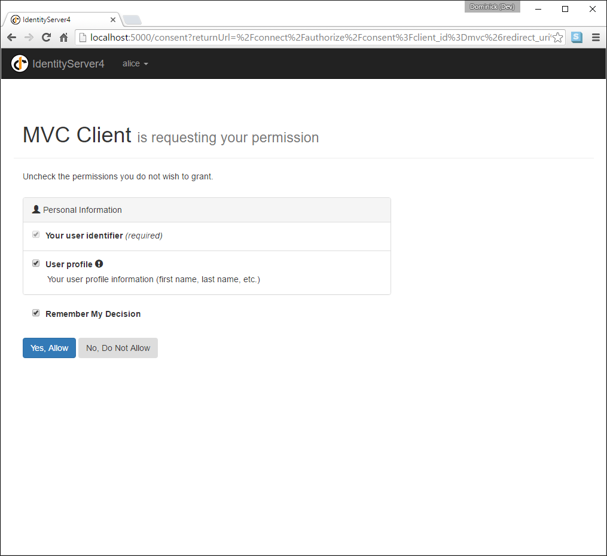

.. _refImplicitQuickstart:
Adding User Authentication with OpenID Connect
==============================================

In this quickstart we want to add support for interactive user authentication via the
OpenID Connect protocol to our IdentityServer.

Once that is in place, we will create an MVC application that will use IdentityServer for 
authentication.

Adding the UI
^^^^^^^^^^^^^
All the protocol support needed for OpenID Connect is already built into IdentityServer.
You need to provide the necessary UI parts for login, logout, consent and error.

While the look & feel as well as the exact workflows will probably always differ in every
IdentityServer implementation, we provide an MVC-based sample UI that you can use as a starting point.

This UI can be found in the `Quickstart UI repo <https://github.com/IdentityServer/IdentityServer4.Quickstart.UI/tree/master>`_.
You can either clone or download this repo and drop the controllers, views, models and CSS into your IdentityServer web application.

Alternatively you can run this command from the command line in the same directory as your IdentityServer web application to
automate the download::

    iex ((New-Object System.Net.WebClient).DownloadString('https://raw.githubusercontent.com/IdentityServer/IdentityServer4.Quickstart.UI/master/getmaster.ps1'))

For Unix/Linux::

    \curl -L https://raw.githubusercontent.com/IdentityServer/IdentityServer4.Quickstart.UI/master/getmaster.sh | bash

Once you have added the MVC UI assets, you will also need to add MVC to the hosting application, both in the DI system and in the pipeline.
Add MVC to ``ConfigureServices`` with the ``AddMvc`` extension method::

    public void ConfigureServices(IServiceCollection services)
    {
        services.AddMvc();

        // configure identity server with in-memory stores, keys, clients and scopes
        services.AddIdentityServer()
            .AddDeveloperSigningCredential()
            .AddInMemoryApiResources(Config.GetApiResources())
            .AddInMemoryClients(Config.GetClients())
            .AddTestUsers(Config.GetUsers());
    }

Add MVC as the last middleware in the pipeline in ``Configure`` with the ``UseMvc`` extension method::

    public void Configure(IApplicationBuilder app, IHostingEnvironment env)
    {
        if (env.IsDevelopment())
        {
            app.UseDeveloperExceptionPage();
        }

        app.UseIdentityServer();

        app.UseStaticFiles();
        app.UseMvcWithDefaultRoute();
    }

See the `readme <https://github.com/IdentityServer/IdentityServer4.Quickstart.UI/blob/master/README.md>`_ for the quickstart UI for more information. 

.. note:: The ``release`` branch of the UI repo has the UI that matches the latest stable release. The ``dev`` branch goes along with the current dev build of IdentityServer4. If you are looking for a specific version of the UI - check the tags.

Spend some time inspecting the controllers and models, the better you understand them, 
the easier it will be to make future modifications. 
Most of the code lives in the "Quickstart" folder using a "feature folder" style. 
If this style doesn't suit you, feel free to organize the code in any way you want.

Creating an MVC client
^^^^^^^^^^^^^^^^^^^^^^
Next you will add an MVC application to your solution.
Use the ASP.NET Core "Web Application" (i.e. MVC) template for that. 
Don't configure the "Authentication" settings in the wizard -- you will do this manually in this quickstart.
Once you've created the project, configure the application to use port 5002 (see the overview part for instructions on how to do that).

To add support for OpenID Connect authentication to the MVC application, add the following to ``ConfigureServices`` in ``Startup``::

    public void ConfigureServices(IServiceCollection services)
    {
        services.AddMvc();

        JwtSecurityTokenHandler.DefaultInboundClaimTypeMap.Clear();

        services.AddAuthentication(options =>
            {
                options.DefaultScheme = "Cookies";
                options.DefaultChallengeScheme = "oidc";
            })
            .AddCookie("Cookies")
            .AddOpenIdConnect("oidc", options =>
            {
                options.SignInScheme = "Cookies";

                options.Authority = "http://localhost:5000";
                options.RequireHttpsMetadata = false;

                options.ClientId = "mvc";
                options.SaveTokens = true;
            });
    }

``AddAuthentication`` adds the authentication services to DI.
We are using a cookie as the primary means to authenticate a user (via ``"Cookies"`` as the ``DefaultScheme``).
We set the ``DefaultChallengeScheme`` to ``"oidc"`` because when we need the user to login, we will be using the OpenID Connect scheme.

We then use ``AddCookie`` to add the handler that can process cookies.

Finally, ``AddOpenIdConnect`` is used to configure the handler that perform the OpenID Connect protocol.
The ``Authority`` indicates that we are trusting IdentityServer.
We then identify this client via the ``ClientId``.
``SignInScheme`` is used to issue a cookie using the cookie handler once the OpenID Connect protocol is complete.
And ``SaveTokens`` is used to persist the tokens from IdentityServer in the cookie (as they will be needed later).

As well, we've turned off the JWT claim type mapping to allow well-known claims (e.g. 'sub' and 'idp') to flow through unmolested::

    JwtSecurityTokenHandler.DefaultInboundClaimTypeMap.Clear();

And then to ensure the authentication services execute on each request, add ``UseAuthentication`` to ``Configure`` in ``Startup``::

    public void Configure(IApplicationBuilder app, IHostingEnvironment env)
    {
        if (env.IsDevelopment())
        {
            app.UseDeveloperExceptionPage();
        }
        else
        {
            app.UseExceptionHandler("/Home/Error");
        }

        app.UseAuthentication();

        app.UseStaticFiles();
        app.UseMvcWithDefaultRoute();
    }

The authentication middleware should be added before the MVC in the pipeline.

The last step is to trigger the authentication handshake. For that go to the home controller and
add the ``[Authorize]`` on one of the actions.
Also modify the view of that action to display the claims of the user, e.g.::

    <dl>
        @foreach (var claim in User.Claims)
        {
            <dt>@claim.Type</dt>
            <dd>@claim.Value</dd>
        }
    </dl>

If you now navigate to that controller using the browser, a redirect attempt will be made
to IdentityServer - this will result in an error because the MVC client is not registered yet.

Adding support for OpenID Connect Identity Scopes
^^^^^^^^^^^^^^^^^^^^^^^^^^^^^^^^^^^^^^^^^^^^^^^^^
Similar to OAuth 2.0, OpenID Connect also uses the scopes concept.
Again, scopes represent something you want to protect and that clients want to access.
In contrast to OAuth, scopes in OIDC don't represent APIs, but identity data like user id, 
name or email address.

Add support for the standard ``openid`` (subject id) and ``profile`` (first name, last name etc..) scopes
by adding a new helper (in ``Config.cs``) to create a collection of ``IdentityResource`` objects::

    public static IEnumerable<IdentityResource> GetIdentityResources()
    {
        return new List<IdentityResource>
        {
            new IdentityResources.OpenId(),
            new IdentityResources.Profile(),
        };
    }

.. note:: All standard scopes and their corresponding claims can be found in the OpenID Connect `specification <https://openid.net/specs/openid-connect-core-1_0.html#ScopeClaims>`_

You will then need to add these identity resources to your IdentityServer configuration in ``Startup.cs``. 
Use the ``AddInMemoryIdentityResources`` extension method where you call ``AddIdentityServer()``::

    public void ConfigureServices(IServiceCollection services)
    {
        services.AddMvc();

        // configure identity server with in-memory stores, keys, clients and scopes
        services.AddIdentityServer()
            .AddDeveloperSigningCredential()
            .AddInMemoryIdentityResources(Config.GetIdentityResources())
            .AddInMemoryApiResources(Config.GetApiResources())
            .AddInMemoryClients(Config.GetClients())
            .AddTestUsers(Config.GetUsers());
    }

Adding a client for OpenID Connect implicit flow
^^^^^^^^^^^^^^^^^^^^^^^^^^^^^^^^^^^^^^^^^^^^^^^^^
The last step is to add a new configuration entry for the MVC client to IdentityServer.

OpenID Connect-based clients are very similar to the OAuth 2.0 clients we added so far.
But since the flows in OIDC are always interactive, we need to add some redirect URLs to our configuration.

Add the following to your clients configuration::

    public static IEnumerable<Client> GetClients()
    {
        return new List<Client>
        {
            // other clients omitted...

            // OpenID Connect implicit flow client (MVC)
            new Client
            {
                ClientId = "mvc",
                ClientName = "MVC Client",
                AllowedGrantTypes = GrantTypes.Implicit,
                
                // where to redirect to after login
                RedirectUris = { "http://localhost:5002/signin-oidc" },

                // where to redirect to after logout
                PostLogoutRedirectUris = { "http://localhost:5002/signout-callback-oidc" },

                AllowedScopes = new List<string>
                {
                    IdentityServerConstants.StandardScopes.OpenId,
                    IdentityServerConstants.StandardScopes.Profile
                }
            }
        };
    }

Testing the client
^^^^^^^^^^^^^^^^^^
Now finally everything should be in place for the new MVC client.

Trigger the authentication handshake by navigating to the protected controller action.
You should see a redirect to the login page at IdentityServer.

.. image:: images/3_login.png

After successful login, the user is presented with the consent screen.
Here the user can decide if he wants to release his identity information to the client application.

.. note:: Consent can be turned off on a per client basis using the ``RequireConsent`` property on the client object.

..and finally the browser redirects back to the client application, which shows the claims
of the user.

.. image:: images/3_claims.png

.. note:: During development you might sometimes see an exception stating that the token could not be validated. This is due to the fact that the signing key material is created on the fly and kept in-memory only. This exception happens when the client and IdentityServer get out of sync. Simply repeat the operation at the client, the next time the metadata has caught up, and everything should work normal again.

Adding sign-out
^^^^^^^^^^^^^^^
The very last step is to add sign-out to the MVC client.

With an authentication service like IdentityServer, it is not enough to clear the local application cookies.
In addition you also need to make a roundtrip to IdentityServer to clear the central single sign-on session.

The exact protocol steps are implemented inside the OpenID Connect middleware, 
simply add the following code to some controller to trigger the sign-out::

    public async Task Logout()
    {
        await HttpContext.SignOutAsync("Cookies");
        await HttpContext.SignOutAsync("oidc");
    }

This will clear the local cookie and then redirect to IdentityServer.
IdentityServer will clear its cookies and then give the user a link to return back to the MVC application.

Further experiments
^^^^^^^^^^^^^^^^^^^
As mentioned above, the OpenID Connect middleware asks for the *profile* scope by default.
This scope also includes claims like *name* or *website*.

Let's add these claims to the user, so IdentityServer can put them into the identity token::

    public static List<TestUser> GetUsers()
    {
        return new List<TestUser>
        {
            new TestUser
            {
                SubjectId = "1",
                Username = "alice",
                Password = "password",

                Claims = new []
                {
                    new Claim("name", "Alice"),
                    new Claim("website", "https://alice.com")
                }
            },
            new TestUser
            {
                SubjectId = "2",
                Username = "bob",
                Password = "password",

                Claims = new []
                {
                    new Claim("name", "Bob"),
                    new Claim("website", "https://bob.com")
                }
            }
        };
    }

Next time you authenticate, your claims page will now show the additional claims.

Feel free to add more claims - and also more scopes. The ``Scope`` property on the OpenID Connect 
middleware is where you configure which scopes will be sent to IdentityServer during authentication.

It is also noteworthy, that the retrieval of claims for tokens is an extensibility point - ``IProfileService``.
Since we are using ``AddTestUsers``, the ``TestUserProfileService`` is used by default.
You can inspect the source code `here <https://github.com/IdentityServer/IdentityServer4/blob/dev/src/Test/TestUserProfileService.cs>`_
to see how it works.
