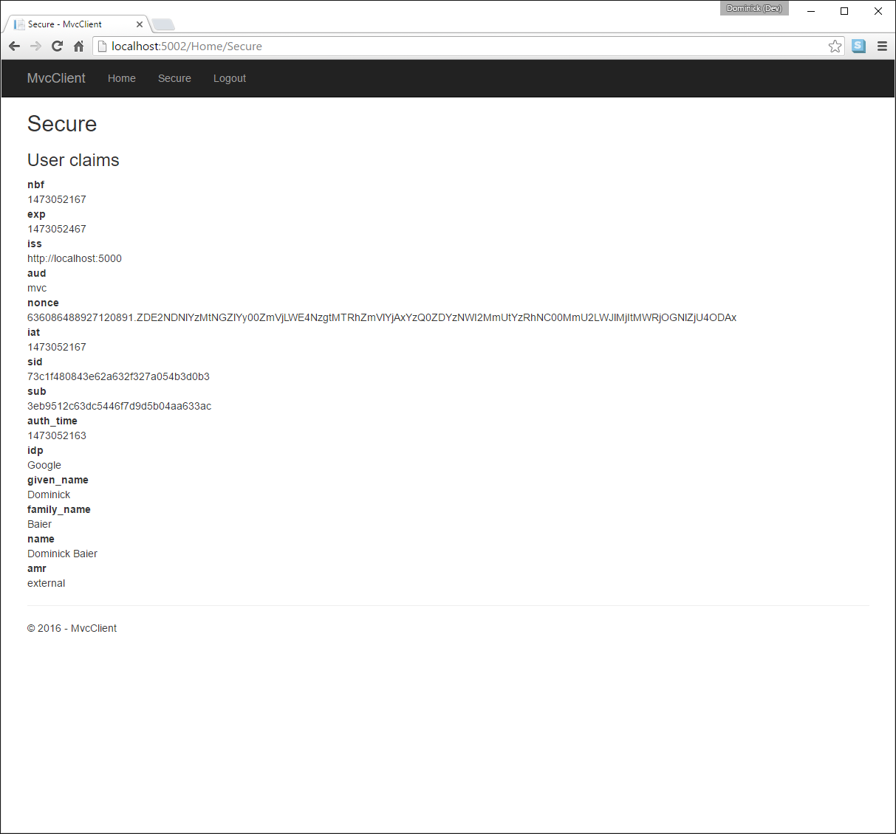

.. _refExternalAuthenticationQuickstart:
Adding Support for External Authentication
==========================================

Next we will add support for external authentication.
This is really easy, because all you really need is an ASP.NET Core compatible authentication middleware.

ASP.NET Core itself ships with support for Google, Facebook, Twitter, Microsoft Account and OpenID Connect.
In Addition you can find providers for many other authentication provider `here <https://github.com/aspnet-contrib/AspNet.Security.OAuth.Providers>`_.

Adding Google support
^^^^^^^^^^^^^^^^^^^^^
To be able to use Google for authentication, you first need to register with them.
This is done at their developer `console <https://console.developers.google.com/>`_.
Create a new project, enable the Google+ API and configure the callback address of your
local IdentityServer by adding the */signin-google* path to your base-address (e.g. http://localhost:5000/signin-google).

If you are running on port 5000 - you can simply use the client id/secret from the code snippet
below, since this is pre-registered by us.

Add the Google and cookie authentication package to your project.json::

    "Microsoft.AspNetCore.Authentication.Cookies": "1.0.0",
    "Microsoft.AspNetCore.Authentication.Google": "1.0.0"

Next we need to add the middleware to the pipeline.
Order is important, the additional authentication middleware must run **after**
IdentityServer and **before** MVC.

By default, we wire up a cookie middleware behind the scenes, so that the external authentication can
store its outcome. You simply need to add the external authentication middleware to the pipeline and make it use
the ``IdentityServerConstants.ExternalCookieAuthenticationScheme`` sign-in scheme::

    app.UseGoogleAuthentication(new GoogleOptions
    {
        AuthenticationScheme = "Google",
        DisplayName = "Google",
        SignInScheme = IdentityServerConstants.ExternalCookieAuthenticationScheme,

        ClientId = "434483408261-55tc8n0cs4ff1fe21ea8df2o443v2iuc.apps.googleusercontent.com",
        ClientSecret = "3gcoTrEDPPJ0ukn_aYYT6PWo"
    });

Now run the MVC client and try to authenticate - you will see a Google button on the login page:

.. image:: images/4_login_page.png

After authentication, you can see that the claims are now being sourced from Google data.

Further experiments
^^^^^^^^^^^^^^^^^^^
You can add an additional external provider.
We have a cloud-hosted demo version of IdentityServer4 which you can integrate using OpenID Connect.

First add the OpenID Connect package to project.json::

    "Microsoft.AspNetCore.Authentication.OpenIdConnect": "1.0.0"

Next add the middleware::

    // middleware for external openid connect authentication
    app.UseOpenIdConnectAuthentication(new OpenIdConnectOptions
    {
        SignInScheme = IdentityServerConstants.ExternalCookieAuthenticationScheme,
        SignOutScheme = IdentityServerConstants.SignoutScheme,

        DisplayName = "OpenID Connect",
        Authority = "https://demo.identityserver.io/",
        ClientId = "implicit",

        TokenValidationParameters = new TokenValidationParameters
        {
            NameClaimType = "name",
            RoleClaimType = "role"
        }
    });

.. note:: The quickstart UI auto-provisions external users. IOW - if an external user logs in for the first time, a new local user is created, all the external claims are copied over and associated with the new user. The way you deal with such a situation is completely up to you though. Maybe you want to show some sort of registration UI first. The source code for the default quickstart can be found `here <https://github.com/IdentityServer/IdentityServer4/blob/dev/src/Host/Quickstart/Account/AccountService.cs>`_.
