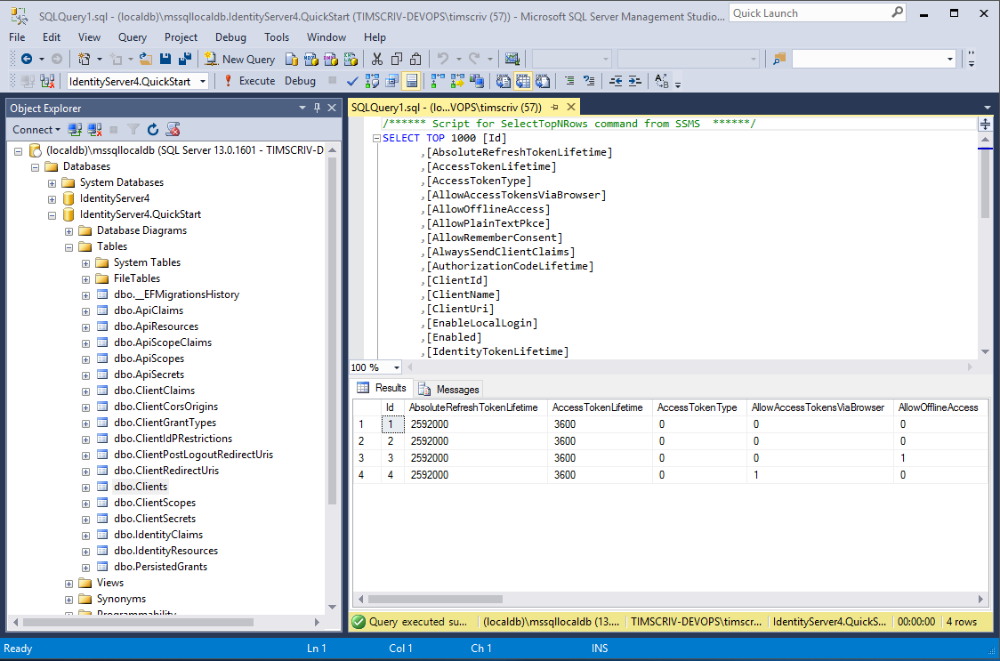

.. _refEntityFrameworkQuickstart:
Using EntityFramework Core for configuration and operational data
=================================================================

In the previous quickstarts, we created our client and scope data in code.
On startup, IdentityServer loaded this configuration data into memory.
If we wanted to modify this configuration data, we had to stop and start IdentityServer.

IdentityServer also generates temporary data, such as authorization codes, consent choices, and refresh tokens.
By default, these are also stored in-memory.

To move this data into a database that is persistent between restarts and across multiple IdentityServer instances, we can use the IdentityServer4 Entity Framework library.

.. Note:: In addition to manually configuring EF support, there is also an IdentityServer template to create a new project with EF support, using ``dotnet new is4ef``.

IdentityServer4.EntityFramework
^^^^^^^^^^^^^^^^^^^^^^^^^^^^^^^
``IdentityServer4.EntityFramework`` implements the required stores and services using the following DbContexts:

    * ConfigurationDbContext - used for configuration data such as clients, resources, and scopes
    * PersistedGrantDbContext - used for temporary operational data such as authorization codes, and refresh tokens

These contexts are suitable for any Entity Framework Core compatible relational database.

You can find these contexts, their entities, and the IdentityServer4 stores that use them in the ``IdentityServer4.EntityFramework.Storage`` nuget package.

You can find the extension methods to register them in your IdentityServer in ``IdentityServer4.EntityFramework``, which we will do now::

    dotnet add package IdentityServer4.EntityFramework

Using SqlServer
^^^^^^^^^^^^^^^

For this quickstart, we will use the LocalDb version of SQLServer that comes with Visual Studio.
To add SQL Server support to our IdentityServer project, you’ll need the following nuget package::

    dotnet add package Microsoft.EntityFrameworkCore.SqlServer

Database Schema Changes and Using EF Migrations
^^^^^^^^^^^^^^^^^^^^^^^^^^^^^^^^^^^^^^^^^^^^^^^

The ``IdentityServer4.EntityFramework.Storage`` package contains entity classes that map from IdentityServer’s models.
As IdentityServer’s models change, so will the entity classes in ``IdentityServer4.EntityFramework.Storage``.
As you use ``IdentityServer4.EntityFramework.Storage`` and upgrade over time, you are responsible for your database schema and changes necessary to that schema as the entity classes change.
One approach for managing those changes is to use `EF migrations <https://docs.microsoft.com/en-us/ef/core/managing-schemas/migrations/index>`_, which is what we’ll use in this quickstart.
If migrations are not your preference, then you can manage the schema changes in any way you see fit.

.. Note:: You can find the `latest SQL scripts <https://github.com/IdentityServer/IdentityServer4/tree/main/src/EntityFramework.Storage/migrations/SqlServer/Migrations>`_ for SqlServer in the IdentityServer4.EntityFramework.Storage repository.

Configuring the Stores
^^^^^^^^^^^^^^^^^^^^^^

To start using these stores, you’ll need to replace any existing calls to ``AddInMemoryClients``, ``AddInMemoryIdentityResources``, ``AddInMemoryApiScopes``, ``AddInMemoryApiResources``, and ``AddInMemoryPersistedGrants`` in your ``ConfigureServices`` method in `Startup.cs` with ``AddConfigurationStore`` and ``AddOperationalStore``.

These methods each require a ``DbContextOptionsBuilder``, meaning your code will look something like this::

    var migrationsAssembly = typeof(Startup).GetTypeInfo().Assembly.GetName().Name;
    const string connectionString = @"Data Source=(LocalDb)\MSSQLLocalDB;database=IdentityServer4.Quickstart.EntityFramework-4.0.0;trusted_connection=yes;";

    services.AddIdentityServer()
        .AddTestUsers(TestUsers.Users)
        .AddConfigurationStore(options =>
        {
            options.ConfigureDbContext = b => b.UseSqlServer(connectionString,
                sql => sql.MigrationsAssembly(migrationsAssembly));
        })
        .AddOperationalStore(options =>
        {
            options.ConfigureDbContext = b => b.UseSqlServer(connectionString,
                sql => sql.MigrationsAssembly(migrationsAssembly));
        });

You might need these namespaces added to the file::

    using Microsoft.EntityFrameworkCore;
    using System.Reflection;

Because we are using EF migrations in this quickstart, the call to ``MigrationsAssembly`` is used to inform Entity Framework that the host project will contain the migrations code.
This is necessary since the host project is in a different assembly than the one that contains the ``DbContext`` classes.

Adding Migrations
^^^^^^^^^^^^^^^^^

Once the IdentityServer has been configured to use Entity Framework, we’ll need to generate some migrations.

To create migrations, you will need to install the Entity Framework Core CLI on your machine and the ``Microsoft.EntityFrameworkCore.Design`` nuget package in IdentityServer::

    dotnet tool install --global dotnet-ef
    dotnet add package Microsoft.EntityFrameworkCore.Design

To create the migrations, open a command prompt in the IdentityServer project directory and run the following two commands::

    dotnet ef migrations add InitialIdentityServerPersistedGrantDbMigration -c PersistedGrantDbContext -o Data/Migrations/IdentityServer/PersistedGrantDb
    dotnet ef migrations add InitialIdentityServerConfigurationDbMigration -c ConfigurationDbContext -o Data/Migrations/IdentityServer/ConfigurationDb

You should now see a ``~/Data/Migrations/IdentityServer`` folder in your project containing the code for your newly created migrations.

Initializing the Database
^^^^^^^^^^^^^^^^^^^^^^^^^

Now that we have the migrations, we can write code to create the database from the migrations.
We can also seed the database with the in-memory configuration data that we already defined in the previous quickstarts.

.. Note:: The approach used in this quickstart is used to make it easy to get IdentityServer up and running. You should devise your own database creation and maintenance strategy that is appropriate for your architecture.

In `Startup.cs` add this method to help initialize the database::

    private void InitializeDatabase(IApplicationBuilder app)
    {
        using (var serviceScope = app.ApplicationServices.GetService<IServiceScopeFactory>().CreateScope())
        {
            serviceScope.ServiceProvider.GetRequiredService<PersistedGrantDbContext>().Database.Migrate();

            var context = serviceScope.ServiceProvider.GetRequiredService<ConfigurationDbContext>();
            context.Database.Migrate();
            if (!context.Clients.Any())
            {
                foreach (var client in Config.Clients)
                {
                    context.Clients.Add(client.ToEntity());
                }
                context.SaveChanges();
            }

            if (!context.IdentityResources.Any())
            {
                foreach (var resource in Config.IdentityResources)
                {
                    context.IdentityResources.Add(resource.ToEntity());
                }
                context.SaveChanges();
            }

            if (!context.ApiScopes.Any())
            {
                foreach (var resource in Config.ApiScopes)
                {
                    context.ApiScopes.Add(resource.ToEntity());
                }
                context.SaveChanges();
            }
        }
    }

The above code may require you to add the following namespaces to your file::

    using System.Linq;
    using IdentityServer4.EntityFramework.DbContexts;
    using IdentityServer4.EntityFramework.Mappers;

And then we can invoke this from the ``Configure`` method::

    public void Configure(IApplicationBuilder app)
    {
        // this will do the initial DB population
        InitializeDatabase(app);

        // the rest of the code that was already here
        // ...
    }

Now if you run the IdentityServer project, the database should be created and seeded with the quickstart configuration data.
You should be able to use SQL Server Management Studio or Visual Studio to connect and inspect the data.

.. Note:: The above ``InitializeDatabase`` helper API is convenient to seed the database, but this approach is not ideal to leave in to execute each time the application runs. Once your database is populated, consider removing the call to the API.

Run the client applications
^^^^^^^^^^^^^^^^^^^^^^^^^^^

You should now be able to run any of the existing client applications and sign-in, get tokens, and call the API -- all based upon the database configuration.
