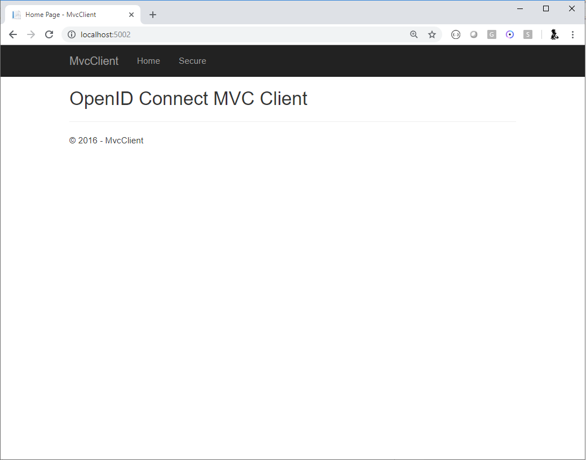
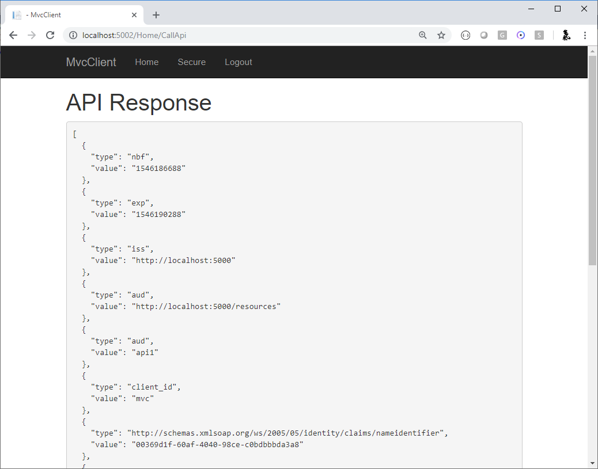

.. _refAspNetIdentityQuickstart:
Using ASP.NET Core Identity
===========================

.. note:: For any pre-requisites (like e.g. templates) have a look at the :ref:`overview <refQuickstartOverview>` first.

IdentityServer is designed for flexibility and part of that is allowing you to use any database you want for your users and their data (including passwords).
If you are starting with a new user database, then ASP.NET Core Identity is one option you could choose.
This quickstart shows how to use ASP.NET Core Identity with IdentityServer.

The approach this quickstart takes to using ASP.NET Core Identity is to create a new project for the IdentityServer host.
This new project will replace the prior IdentityServer project we built up in the previous quickstarts.
The reason for this new project is due to the differences in UI assets when using ASP.NET Core Identity (mainly around the differences in login and logout).
All the other projects in this solution (for the clients and the API) will remain the same.

.. Note:: This quickstart assumes you are familiar with how ASP.NET Core Identity works. If you are not, it is recommended that you first `learn about it <https://docs.microsoft.com/en-us/aspnet/core/security/authentication/identity>`_.

New Project for ASP.NET Core Identity
^^^^^^^^^^^^^^^^^^^^^^^^^^^^^^^^

The first step is to add a new project for ASP.NET Core Identity to your solution.
We provide a template that contains the minimal UI assets needed to ASP.NET Core Identity with IdentityServer.
You will eventually delete the old project for IdentityServer, but there are some items that you will need to migrate over.

Start by creating a new IdentityServer project that will use ASP.NET Core Identity::
    
    cd quickstart/src
    dotnet new is4aspid -n IdentityServerAspNetIdentity

When prompted to "seed" the user database, choose "Y" for "yes".
This populates the user database with our "alice" and "bob" users. 
Their passwords are "Pass123$".

.. Note:: The template uses Sqlite as the database for the users, and EF migrations are pre-created in the template. If you wish to use a different database provider, you will need to change the provider used in the code and re-create the EF migrations.

Inspect the new project
^^^^^^^^^^^^^^^^^^^^^^^

Open the new project in the editor of your choice, and inspect the generated code.
Be sure to look at:

IdentityServerAspNetIdentity.csproj
-----------------------------------

Notice the reference to `IdentityServer4.AspNetIdentity`. 
This NuGet package contains the ASP.NET Core Identity integration components for IdentityServer.

Startup.cs
----------

In `ConfigureServices` notice the necessary ``AddDbContext<ApplicationDbContext>`` and ``AddIdentity<ApplicationUser, IdentityRole>`` calls are done to configure ASP.NET Core Identity.

Also notice that much of the same IdentityServer configuration you did in the previous quickstarts is already done.
The template uses the in-memory style for clients and resources, and those are sourced from `Config.cs`.

Finally, notice the addition of the new call to ``AddAspNetIdentity<ApplicationUser>``.
``AddAspNetIdentity`` adds the integration layer to allow IdentityServer to access the user data for the ASP.NET Core Identity user database.
This is needed when IdentityServer must add claims for the users into tokens.

Note that ``AddIdentity<ApplicationUser, IdentityRole>`` must be invoked before ``AddIdentityServer``.

Config.cs
-----------

`Config.cs` contains the hard-coded in-memory clients and resource definitions.
To keep the same clients and API working as the prior quickstarts, we need to copy over the configuration data from the old IdentityServer project into this one.
Do that now, and afterwards `Config.cs` should look like this::

    public static class Config
    {
        public static IEnumerable<IdentityResource> IdentityResources =>
            new List<IdentityResource>
            {
                new IdentityResources.OpenId(),
                new IdentityResources.Profile(),
            };

        public static IEnumerable<ApiScope> ApiScopes =>
            new List<ApiScope>
            {
                new ApiScope("api1", "My API")
            };

        public static IEnumerable<Client> Clients =>
            new List<Client>
            {
                // machine to machine client
                new Client
                {
                    ClientId = "client",
                    ClientSecrets = { new Secret("secret".Sha256()) },

                    AllowedGrantTypes = GrantTypes.ClientCredentials,
                    // scopes that client has access to
                    AllowedScopes = { "api1" }
                },
                
                // interactive ASP.NET Core MVC client
                new Client
                {
                    ClientId = "mvc",
                    ClientSecrets = { new Secret("secret".Sha256()) },

                    AllowedGrantTypes = GrantTypes.Code,
                    
                    // where to redirect to after login
                    RedirectUris = { "https://localhost:5002/signin-oidc" },

                    // where to redirect to after logout
                    PostLogoutRedirectUris = { "https://localhost:5002/signout-callback-oidc" },

                    AllowedScopes = new List<string>
                    {
                        IdentityServerConstants.StandardScopes.OpenId,
                        IdentityServerConstants.StandardScopes.Profile,
                        "api1"
                    }
                }
            };
    }

At this point, you no longer need the old IdentityServer project.

Program.cs and SeedData.cs
--------------------------

`Program.cs`'s ``Main`` is a little different than most ASP.NET Core projects.
Notice how this looks for a command line argument called `/seed` which is used as a flag to seed the users in the ASP.NET Core Identity database.

Look at the ``SeedData`` class' code to see how the database is created and the first users are created.

AccountController
-----------------

The last code to inspect in this template is the ``AccountController``. 
This contains a slightly different login and logout code than the prior quickstart and templates.
Notice the use of the ``SignInManager<ApplicationUser>`` and ``UserManager<ApplicationUser>`` from ASP.NET Core Identity to validate credentials and manage the authentication session.

Much of the rest of the code is the same from the prior quickstarts and templates.

Logging in with the MVC client
^^^^^^^^^^^^^^^^^^^^^^^^^^^^^^

At this point, you should be able to run all of the existing clients and samples.
One exception is the `ResourceOwnerClient` -- the password will need to be updated to ``Pass123$`` from ``password``.

Launch the MVC client application, and you should be able to click the "Secure" link to get logged in.

You should be redirected to the ASP.NET Core Identity login page.
Login with your newly created user:

.. image:: images/aspid_login.png

After login you see the normal consent page. 
After consent you will be redirected back to the MVC client application where your user's claims should be listed.

.. image:: images/aspid_claims.png

You should also be able to click "Call API using application identity" to invoke the API on behalf of the user:

And now you're using users from ASP.NET Core Identity in IdentityServer.

What's Missing?
^^^^^^^^^^^^^^^

Much of the rest of the code in this template is similar to the other quickstart and templates we provide.
The one thing you will notice that is missing from this template is UI code for user registration, password reset, and the other things you might expect from the Visual Studio ASP.NET Core Identity template.

Given the variety of requirements and different approaches to using ASP.NET Core Identity, our template deliberately does not provide those features.
You are expected to know how ASP.NET Core Identity works sufficiently well to add those features to your project.
Alternatively, you can create a new project based on the Visual Studio ASP.NET Core Identity template and add the IdentityServer features you have learned about in these quickstarts to that project.
