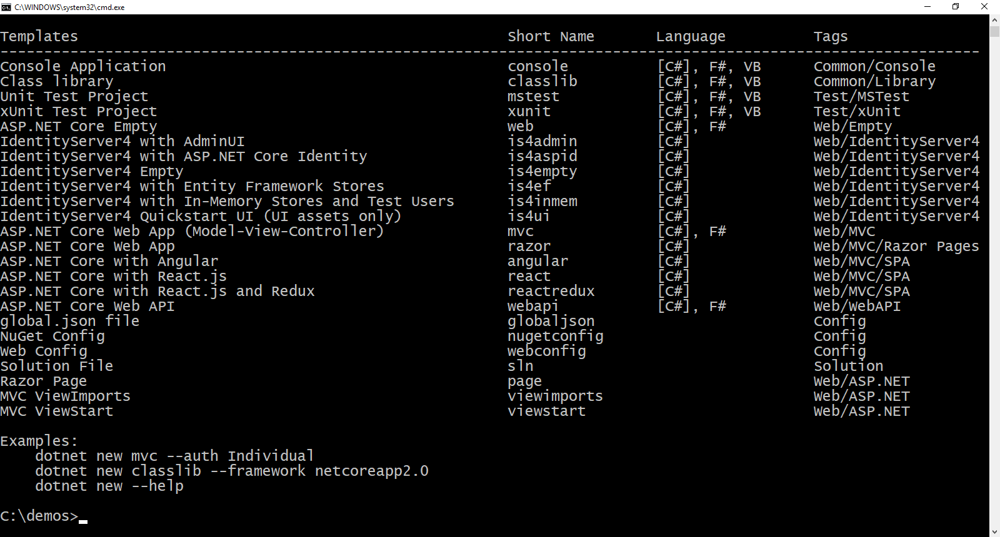

.. _refAspNetIdentityQuickstart:
Using ASP.NET Core Identity
===========================

In the prior quickstarts, the users of the application were modeled with hard-coded, in-memory usernames and passwords.
IdentityServer is designed for flexibility and part of that is allowing you to use any database you want for your users and their data (including passwords).
If you are starting with a new user database, then ASP.NET Identity is one option you could choose to manage your users' identity information.
This quickstart shows how to use ASP.NET Identity with IdentityServer.

To use ASP.NET Identity, a new project will be created to replace the "QuickstartIdentityServer" that was used in the prior quickstarts.
You will use the "IdentityServer with ASP.NET Identity" template to create the new project.
All the other projects in this solution (for the clients and the API) will remain the same.

Install the IdentityServer Templates
^^^^^^^^^^^^^^^^^^^^^^^^^^^^^^^^^^^^

If you haven't already, you will need to install the IdentityServer templates.
They can be installed by running a ``dotnet`` command from the command line::

    dotnet new -i IdentityServer.Templates

Once installed you should see the various templates when you run ``dotnet new`` from the command line:

.. Note:: To reset your ``dotnet new`` back to the defaults you can run ``dotnet new --debug:reinit``.

Create a new project for ASP.NET Identity
^^^^^^^^^^^^^^^^^^^^^^^^^^^^^^^^^^^^^^^^^

The first step to using ASP.NET Identity is to create a new project using the `IdentityServer4 with ASP.NET Core Identity` template.
From the command line create an empty directory where you would like the project files to be located.
Then from within that directory run ``dotnet new is4aspid`` to create the new project.
When prompted if you want to seed the initial database, enter ``Y``.
This will create the initial users `alice` and `bob` in the database with the password `Pass123$`.

Next, you will want to add this new project to the solution you have been working with.
Finally, you can also remove the old `QuickstartIdentityServer` project that was using the in-memory users.

Inspect the new project
^^^^^^^^^^^^^^^^^^^^^^^

Take a look around the new project.
First, notice the NuGet packages referened, specifically `IdentityServer4.AspNetIdentity`.
This is the library that provides configuration for ASP.NET Identity to integrate into IdentityServer.

Next, open `Startup.cs` and notice the configuration for ASP.NET Identity and IdentityServer.
There is a call to ``AddAspNetIdentity<ApplicationUser>`` which is how ASP.NET Identity is integrated into IdentityServer.

.. note:: It's important when using ASP.NET Identity that IdentityServer be registered *after* ASP.NET Identity in the DI system because IdentityServer is overwriting some configuration from ASP.NET Identity.

Finally, open `QuickStart/Account/AccountController.cs` and inspect how the login page interacts with ASP.NET Identity.
If you're not already familiar with the programming model of ASP.NET Identity, consult the ASP.NET documentation.

Scopes and Clients configuration
^^^^^^^^^^^^^^^^^^^^^^^^^^^^^^^^

Despite this being a new project for IdentityServer, we still need the same scope and client configuration as the prior quickstarts.
Copy the configuration class (in `Config.cs <https://github.com/IdentityServer/IdentityServer4.Samples/blob/release/Quickstarts/5_HybridFlowAuthenticationWithApiAccess/src/QuickstartIdentityServer/Config.cs>`_) you used for the previous quickstarts into this new project.

Logging in with the MVC client
^^^^^^^^^^^^^^^^^^^^^^^^^^^^^^

Launch the MVC client application, and you should be able to click the "Secure" link to get logged in.

.. image:: images/6_mvc_client.png

You should be redirected to the ASP.NET Identity login page.
Login with `alice` or `bob`:

.. image:: images/6_login.png

After consent, you should be redirected back to the MVC client application where your user's claims should be listed.

.. image:: images/6_claims.png

You should also be able to click "Call API using application identity" to invoke the API on behalf of the user:

.. image:: images/6_api_claims.png

And now you've logged in with a user from ASP.NET Identity.

What's Next?
^^^^^^^^^^^^

One thing you might have noticed was that the template created above is different than that of Visual Studio when using ASP.NET Identity.
The IdentityServer template for ASP.NET Identity is meant to match as close as possible to the other IdentityServer templates.
If there are additional features that you want in your IdentityServer UI (such as user self-registration, password reset, etc.), then it would then be up to you to add these additional features to your IdentityServer project.
