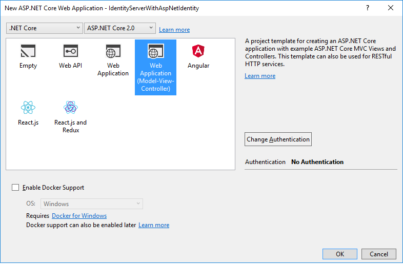
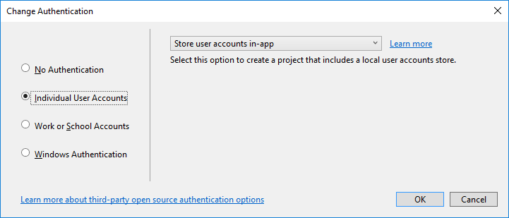

.. _refAspNetIdentityQuickstart:
Using ASP.NET Core Identity
===========================

IdentityServer is designed for flexibility and part of that is allowing you to use any database you want for your users and their data (including passwords).
If you are starting with a new user database, then ASP.NET Identity is one option you could choose.
This quickstart shows how to use ASP.NET Identity with IdentityServer.

This quickstart assumes you've been through all of the prior quickstarts. 
The approach this quickstart takes to using ASP.NET Identity is to create a new project from the ASP.NET Identity template in Visual Studio.
This new project will replace the prior IdentityServer project we built up from scratch in the previous quickstarts.
All the other projects in this solution (for the clients and the API) will remain the same.

New Project for ASP.NET Identity
^^^^^^^^^^^^^^^^^^^^^^^^^^^^^^^^

The first step is to add a new project for ASP.NET Identity to your solution.
Given that a lot of code is required for ASP.NET Identity, it makes sense to use the template from Visual Studio.
You will eventually delete the old project for IdentityServer (assuming you were following the other quickstarts), but there are several items that you will need to migrate over (or rewrite from scratch as described in the prior quickstarts).

Start by creating a new "ASP.NET Core Web Application" project.

.. image:: images/6_new_web_project.png

Then select the "Web Application Template (Model-View-Controller)" option.

Then click the "Change Authentication" button, and choose "Individual User Accounts" (which means to use ASP.NET Identity):

Finally, your new project dialog should look something like this. Once it does, click "OK" to create the project.

.. image:: images/6_web_app_template_with_aspnet_identity.png

Modify hosting
^^^^^^^^^^^^^^^

Don't forget to modify the hosting (`as described here <0_overview.html#modify-hosting>`_) to run on port 5000.
This is important so the existing clients and api projects will continue to work.

Add IdentityServer packages
^^^^^^^^^^^^^^^^^^^^^^^^^^^

Add the ``IdentityServer4.AspNetIdentity`` NuGet package.
This depends on the ``IdentityServer4`` package, so that's automatically added as a transitive dependency.

.. image:: images/6_nuget.png

Scopes and Clients Configuration
^^^^^^^^^^^^^^^^^^^^^^^^^^^^^^^^

Despite this being a new project for IdentityServer, we still need the same scope and client configuration as the prior quickstarts.
Copy the configuration class (in `Config.cs <https://github.com/IdentityServer/IdentityServer4.Samples/blob/master/Quickstarts/5_HybridFlowAuthenticationWithApiAccess/src/QuickstartIdentityServer/Config.cs>`_) you used for the previous quickstarts into this new project.

One change to the configuration that is necessary (for now) is to disable consent for the MVC client.
We've not yet copied over the consent code from the prior IdentityServer project, so for now make this one modification to the MVC client and set ``RequireConsent=false``::

    new Client
    {
        ClientId = "mvc",
        ClientName = "MVC Client",
        AllowedGrantTypes = GrantTypes.HybridAndClientCredentials,

        RequireConsent = false,

        ClientSecrets = 
        {
            new Secret("secret".Sha256())
        },

        RedirectUris           = { "http://localhost:5002/signin-oidc" },
        PostLogoutRedirectUris = { "http://localhost:5002/signout-callback-oidc" },

        AllowedScopes =
        {
            IdentityServerConstants.StandardScopes.OpenId,
            IdentityServerConstants.StandardScopes.Profile,
            "api1"
        },
        AllowOfflineAccess = true
    }

Configure IdentityServer
^^^^^^^^^^^^^^^^^^^^^^^^

As before, IdentityServer needs to be configured in both ``ConfigureServices`` and in ``Configure`` in `Startup.cs`. 

**ConfigureServices**

This shows both the template code generated for ASP.NET Identity, plus the additions needed for IdentityServer (at the end).
In the previous quickstarts, the ``AddTestUsers`` extension method was used to register the users, but in this situation we replace that extension method with ``AddAspNetIdentity`` to use the ASP.NET Identity users instead.
The ``AddAspNetIdentity`` extension method requires a generic parameter which is your ASP.NET Identity user type (the same one needed in the ``AddIdentity`` method from the template).

::

    public void ConfigureServices(IServiceCollection services)
    {
        services.AddDbContext<ApplicationDbContext>(options =>
            options.UseSqlServer(Configuration.GetConnectionString("DefaultConnection")));

        services.AddIdentity<ApplicationUser, IdentityRole>()
            .AddEntityFrameworkStores<ApplicationDbContext>()
            .AddDefaultTokenProviders();

        // Add application services.
        services.AddTransient<IEmailSender, EmailSender>();

        services.AddMvc();

        // configure identity server with in-memory stores, keys, clients and scopes
        services.AddIdentityServer()
            .AddDeveloperSigningCredential()
            .AddInMemoryPersistedGrants()
            .AddInMemoryIdentityResources(Config.GetIdentityResources())
            .AddInMemoryApiResources(Config.GetApiResources())
            .AddInMemoryClients(Config.GetClients())
            .AddAspNetIdentity<ApplicationUser>();
    }

.. note:: It's important when using ASP.NET Identity that IdentityServer be registered *after* ASP.NET Identity in the DI system because IdentityServer is overwriting some configuration from ASP.NET Identity.
    
**Configure**

This shows both the template code generated for ASP.NET Identity, plus the call to ``UseIdentityServer`` which replaces the call to ``UseAuthentication``.

::

    public void Configure(IApplicationBuilder app, IHostingEnvironment env)
    {
        if (env.IsDevelopment())
        {
            app.UseDeveloperExceptionPage();
            app.UseBrowserLink();
            app.UseDatabaseErrorPage();
        }
        else
        {
            app.UseExceptionHandler("/Home/Error");
        }

        app.UseStaticFiles();

        // app.UseAuthentication(); // not needed, since UseIdentityServer adds the authentication middleware
        app.UseIdentityServer();

        app.UseMvc(routes =>
        {
            routes.MapRoute(
                name: "default",
                template: "{controller=Home}/{action=Index}/{id?}");
        });
    }

Creating the user database
^^^^^^^^^^^^^^^^^^^^^^^^^^

Given that this is a new ASP.NET Identity project, you will need to create the database.
You can do this by running a command prompt from the project directory and running ``dotnet ef database update -c ApplicationDbContext``, like this:

.. image:: images/6_ef_database_update.png

Creating a user
^^^^^^^^^^^^^^^
At this point, you should be able to run the project and create/register a user in the database.
Launch the application, and from the home page click the "Register" link:

.. image:: images/6_home_page.png

And on the register page create a new user account:

.. image:: images/6_register_page.png

Now that you have a user account, you should be able to login, use the clients, and invoke the APIs.

Logging in with the MVC client
^^^^^^^^^^^^^^^^^^^^^^^^^^^^^^

Launch the MVC client application, and you should be able to click the "Secure" link to get logged in.

.. image:: images/6_mvc_client.png

You should be redirected to the ASP.NET Identity login page.
Login with your newly created user:

.. image:: images/6_login.png

After login you should skip the consent page (given the change we made above), and be immediately redirected back to the MVC client application where your user's claims should be listed.

.. image:: images/6_claims.png

You should also be able to click "Call API using application identity" to invoke the API on behalf of the user:

.. image:: images/6_api_claims.png

And now you've logged in with a user from ASP.NET Identity.

What's Next?
^^^^^^^^^^^^

The prior quickstart project for IdentityServer provided a consent page, an error page, and a logout page. 
The code for these missing pieces can simply be copied over from the prior quickstart project into this one.
Once you've done that, then you can finally delete/remove the old IdentityServer project. 
Also, once you've done this don't forget to re-enable the ``RequireConsent=true`` flag on the MVC client configuration.

The `sample code for this quickstart <https://github.com/IdentityServer/IdentityServer4.Samples/tree/dev/Quickstarts/6_AspNetIdentity>`_ has already done these steps for you, so you can get started quickly with all of these features.
Enjoy!
