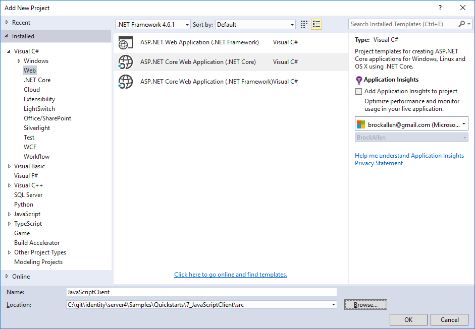
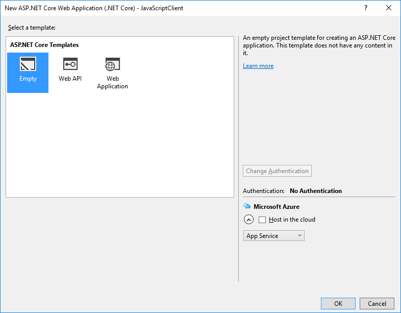
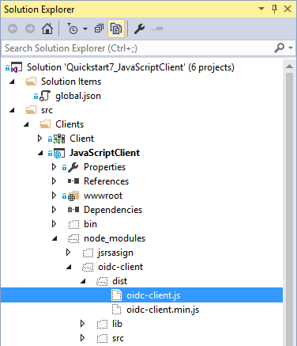
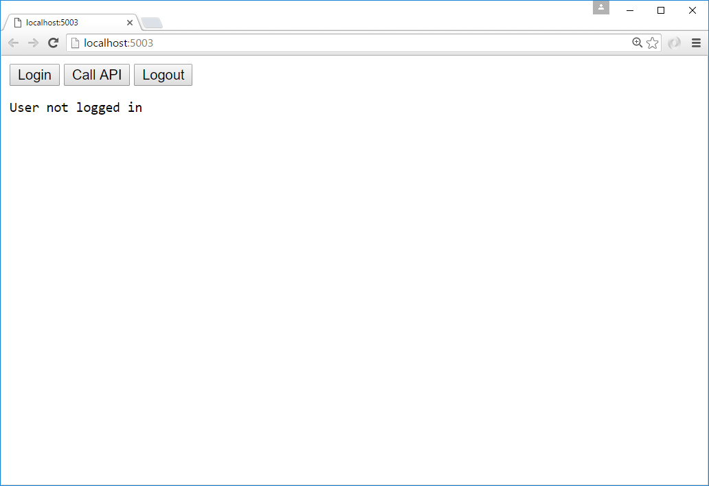

.. _refJavaScriptQuickstart:
Adding a JavaScript client
==========================

This quickstart will show how to build a JavaScript client application. 
The user will login to IdentityServer, invoke the web API with an access token issued by IdentityServer, and logout of IdentityServer.

New Project for the JavaScript client
^^^^^^^^^^^^^^^^^^^^^^^^^^^^^^^^^^^^^

Create a new project for the JavaScript application.
It can simply be an empty web project, or an empty ASP.NET Core application.
This quickstart will use an empty ASP.NET Core application.

Create a new ASP.NET Core web application:

Choose the "Empty" template:

Click the "OK" button to create the project.

Modify hosting
^^^^^^^^^^^^^^^

Modify the hosting (`as described here <0_overview.html#modify-hosting>`_) to run on port 5003.

Add the static file middleware
^^^^^^^^^^^^^^^^^^^^^^^^^^^^^^

Given that this project is designed to mainly run client-side, we need ASP.NET Core to serve up the static HTML and JavaScript files that will make up our application.
The static file middleware is designed to do this.

Register the static file middleware in `Startup.cs` in the ``Configure`` method::

    public void Configure(IApplicationBuilder app)
    {
        app.UseDefaultFiles();
        app.UseStaticFiles();
    }

This middleware will now serve up static files from the application's `~/wwwroot` folder.
This is where we will put our HTML and JavaScript files.

Reference oidc-client
^^^^^^^^^^^^^^^^^^^^^

In the MVC project, we used a library to handle the OpenID Connect protocol. 
In this project we need a similar library, except one that works in JavaScript and is designed to run in the browser.
The `oidc-client library <https://github.com/IdentityModel/oidc-client-js>`_ is one such library. 
It is available via `NPM <https://github.com/IdentityModel/oidc-client-js>`_, `Bower <https://bower.io/search/?q=oidc-client>`_,  as well as a `direct download <https://github.com/IdentityModel/oidc-client-js/tree/master/dist>`_ from github.

**NPM**

If you want to use NPM to download `oidc-client`, then follow these steps:

Add a new NPM package file to your project and name it `package.json`:

In `package.json` add a ``dependency`` to ``oidc-client``::

  "dependencies": {
    "oidc-client": "1.4.1"
  }

Once you have saved this file, Visual Studio should automatically restore these packages into a folder called `node_modules`:

Locate the file called `oidc-client.js` in the `~/node_modules/oidc-client/dist` folder and copy it into your application's `~/wwwroot` folder.
There are more sophisticated ways of copying your NPM packages into `~/wwwroot`, but those techniques are beyond the scope of this quickstart.

Add your HTML and JavaScript files
^^^^^^^^^^^^^^^^^^^^^^^^^^^^^^^^^^^^

Next is to add your HTML and JavaScript files to `~/wwwroot`.
We will have two HTML files and one application-specific JavaScript file (in addition to the `oidc-client.js` library).
In `~/wwwroot`, add a HTML file named `index.html` and `callback.html`, and add a JavaScript file called `app.js`.

**index.html**

This will be the main page in our application. 
It will simply contain the HTML for the buttons for the user to login, logout, and call the web API.
It will also contain the ``
        
    </body>
    </html>

**app.js**

This will contain the main code for our application.
The first thing is to add a helper function to log messages to the ``<pre>``::

    function log() {
        document.getElementById('results').innerText = '';

        Array.prototype.forEach.call(arguments, function (msg) {
            if (msg instanceof Error) {
                msg = "Error: " + msg.message;
            }
            else if (typeof msg !== 'string') {
                msg = JSON.stringify(msg, null, 2);
            }
            document.getElementById('results').innerHTML += msg + '\r\n';
        });
    }

Next, add code to register "click" event handlers to the three buttons::

    document.getElementById("login").addEventListener("click", login, false);
    document.getElementById("api").addEventListener("click", api, false);
    document.getElementById("logout").addEventListener("click", logout, false);

Next, we can use the ``UserManager`` class in the `oidc-client` library to manage the OpenID Connect protocol. 
It requires similar configuration that was necessary in the MVC Client (albeit with different values). 
Add this code to configure and instantiate the ``UserManager``::

    var config = {
        authority: "http://localhost:5000",
        client_id: "js",
        redirect_uri: "http://localhost:5003/callback.html",
        response_type: "id_token token",
        scope:"openid profile api1",
        post_logout_redirect_uri : "http://localhost:5003/index.html",
    };
    var mgr = new Oidc.UserManager(config);

Next, the ``UserManager`` provides a ``getUser`` API to know if the user is logged into the JavaScript application.
It uses a JavaScript ``Promise`` to return the results asynchronously. 
The returned ``User`` object has a ``profile`` property which contains the claims for the user.
Add this code to detect if the user is logged into the JavaScript application::

    mgr.getUser().then(function (user) {
        if (user) {
            log("User logged in", user.profile);
        }
        else {
            log("User not logged in");
        }
    });

Next, we want to implement the ``login``, ``api``, and ``logout`` functions. 
The ``UserManager`` provides a ``signinRedirect`` to log the user in, and a ``signoutRedirect`` to log the user out.
The ``User`` object that we obtained in the above code also has an ``access_token`` property which can be used to authenticate with a web API.
The ``access_token`` will be passed to the web API via the `Authorization` header with the `Bearer` scheme.
Add this code to implement those three functions in our application::

    function login() {
        mgr.signinRedirect();
    }

    function api() {
        mgr.getUser().then(function (user) {
            var url = "http://localhost:5001/identity";

            var xhr = new XMLHttpRequest();
            xhr.open("GET", url);
            xhr.onload = function () {
                log(xhr.status, JSON.parse(xhr.responseText));
            }
            xhr.setRequestHeader("Authorization", "Bearer " + user.access_token);
            xhr.send();
        });
    }

    function logout() {
        mgr.signoutRedirect();
    }

See: `Protecting an API using Client Credentials <http://docs.identityserver.io/en/release/quickstarts/1_client_credentials.html>` for information on how to create the api used in the code above.

**callback.html**

This HTML file is the designated ``redirect_uri`` page once the user has logged into IdentityServer.
It will complete the OpenID Connect protocol sign-in handshake with IdentityServer. 
The code for this is all provided by the ``UserManager`` class we used earlier. 
Once the sign-in is complete, we can then redirect the user back to the main `index.html` page. 
Add this code to complete the signin process::

    <!DOCTYPE html>
    <html>
    <head>
        <meta charset="utf-8" />
        <title></title>
    </head>
    <body>
        
        
    </body>
    </html>

Add a client registration to IdentityServer for the JavaScript client
^^^^^^^^^^^^^^^^^^^^^^^^^^^^^^^^^^^^^^^^^^^^^^^^^^^^^^^^^^^^^^^^^^^^^

Now that the client application is ready to go, we need to define a configuration entry in IdentityServer for this new JavaScript client.
In the IdentityServer project locate the client configuration (in `Config.cs`).
Add a new `Client` to the list for our new JavaScript application.
It should have the configuration listed below::

    // JavaScript Client
    new Client
    {
        ClientId = "js",
        ClientName = "JavaScript Client",
        AllowedGrantTypes = GrantTypes.Implicit,
        AllowAccessTokensViaBrowser = true,

        RedirectUris =           { "http://localhost:5003/callback.html" },
        PostLogoutRedirectUris = { "http://localhost:5003/index.html" },
        AllowedCorsOrigins =     { "http://localhost:5003" },

        AllowedScopes = 
        {
            IdentityServerConstants.StandardScopes.OpenId,
            IdentityServerConstants.StandardScopes.Profile,
            "api1"
        }
    }

Allowing Ajax calls to the Web API with CORS
^^^^^^^^^^^^^^^^^^^^^^^^^^^^^^^^^^^^^^^^^^^^

One last bit of configuration that is necessary is to configure CORS in the web API project. 
This will allow Ajax calls to be made from `http://localhost:5003` to `http://localhost:5001`.

**Configure CORS**

Add the CORS services to the dependency injection system in ``ConfigureServices`` in `Startup.cs`::

    public void ConfigureServices(IServiceCollection services)
    {
        services.AddMvcCore()
            .AddAuthorization()
            .AddJsonFormatters();

        services.AddAuthentication("Bearer")
            .AddIdentityServerAuthentication(options =>
            {
                options.Authority = "http://localhost:5000";
                options.RequireHttpsMetadata = false;

                options.ApiName = "api1";
            });

        services.AddCors(options =>
        {
            // this defines a CORS policy called "default"
            options.AddPolicy("default", policy =>
            {
                policy.WithOrigins("http://localhost:5003")
                    .AllowAnyHeader()
                    .AllowAnyMethod();
            });
        });
    }

Add the CORS middleware to the pipeline in ``Configure``::

    public void Configure(IApplicationBuilder app)
    {
        app.UseCors("default");

        app.UseAuthentication();

        app.UseMvc();
    }

Run the JavaScript application
^^^^^^^^^^^^^^^^^^^^^^^^^^^^^^

Now you should be able to run the JavaScript client application:

Click the "Login" button to sign the user in.
Once the user is returned back to the JavaScript application, you should see their profile information:
 
.. image:: images/7_logged_in.png

And click the "API" button to invoke the web API:

.. image:: images/7_api_results.png

And finally click "Logout" to sign the user out.

.. image:: images/7_signed_out.png

You now have the start of a JavaScript client application that uses IdentityServer for sign-in, sign-out, and authenticating calls to web APIs.
