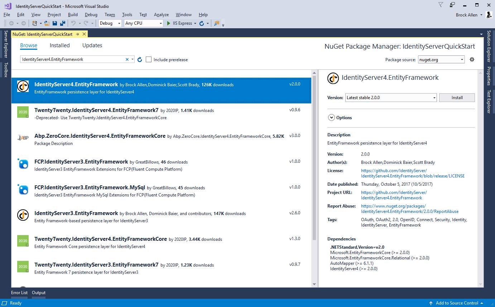
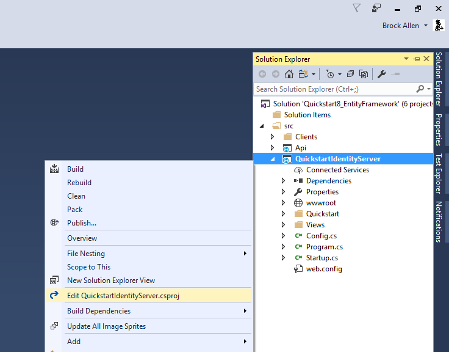
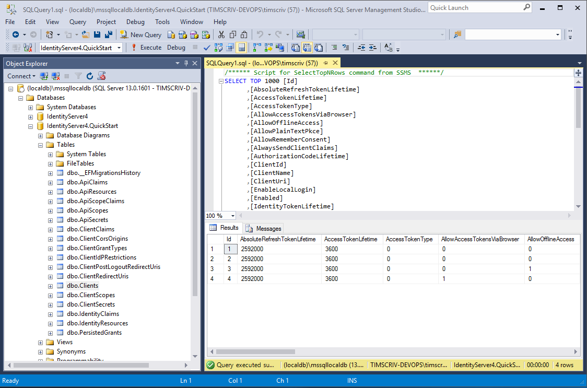

.. _refEntityFrameworkQuickstart:
Using EntityFramework Core for configuration data
=================================================

IdentityServer is designed for extensibility, and one of the extensibility points is the storage mechanism used for data that IdentityServer needs.
This quickstart shows how to configure IdentityServer to use EntityFramework (EF) as the storage mechanism for this data (rather than using the in-memory implementations we had been using up until now).

IdentityServer4.EntityFramework
^^^^^^^^^^^^^^^^^^^^^^^^^^^^^^^

There are two types of data that we are moving to the database. 
The first is the configuration data (resources and clients).
The second is operational data that IdentityServer produces as it's being used.
These stores are modeled with interfaces, and we provide an EF implementation of these interfaces in the `IdentityServer4.EntityFramework` Nuget package.

Get started by adding a reference to the `IdentityServer4.EntityFramework` Nuget package the IdentityServer project (use at least version "1.0.1").

Adding SqlServer
^^^^^^^^^^^^^^^^

Given EF's flexibility, you can then use any EF-supported database.
For this quickstart we will use the LocalDb version of SqlServer that comes with Visual Studio.

To add SqlServer, we need several more NuGet packages.  

Add `Microsoft.EntityFrameworkCore.SqlServer`:

.. image:: images/8_nuget_ef_sqlserver.png

And `Microsoft.EntityFrameworkCore.Tools`:

.. image:: images/8_nuget_ef_tools.png

Next, we need to add some command line tooling (more details `here <https://docs.microsoft.com/en-us/ef/core/miscellaneous/cli/dotnet>`_).
Unfortunately this must be done by hand-editing your `.csproj` file.
To edit the `.csproj` by right-click the project and select "Edit projectname.csproj":

And then add the below snippet before the end `</Project>` element::

    <ItemGroup>
        <DotNetCliToolReference Include="Microsoft.EntityFrameworkCore.Tools.DotNet" Version="1.0.0" />
    </ItemGroup>

It should look something like this:

.. image:: images/8_csproj.png

Save and close the file. 
To test that you have the tools properly installed, you can open a command shell in the same directory as the project and run `dotnet ef`.
It should look like this:

.. image:: images/8_dotnet_ef_command_line.png

Configuring the stores
^^^^^^^^^^^^^^^^^^^^^^

The next step is to replace the current calls to ``AddInMemoryClients``, ``AddInMemoryIdentityResources``, and ``AddInMemoryApiResources`` in the ``Configure`` method in `Startup.cs`.
We will replace them with this code::

  using Microsoft.EntityFrameworkCore;
  using System.Reflection;

  public void ConfigureServices(IServiceCollection services)
  {
      services.AddMvc();

      var connectionString = @"server=(localdb)\mssqllocaldb;database=IdentityServer4.Quickstart.EntityFramework;trusted_connection=yes";
      var migrationsAssembly = typeof(Startup).GetTypeInfo().Assembly.GetName().Name;
            
      // configure identity server with in-memory users, but EF stores for clients and resources
      services.AddIdentityServer()
          .AddTemporarySigningCredential()
          .AddTestUsers(Config.GetUsers())
          .AddConfigurationStore(builder =>
              builder.UseSqlServer(connectionString, options =>
                  options.MigrationsAssembly(migrationsAssembly)))
          .AddOperationalStore(builder =>
              builder.UseSqlServer(connectionString, options =>
                  options.MigrationsAssembly(migrationsAssembly)));
  }

The above code is hard-coding a connection string, which you should feel free to change if you wish.
Also, the calls to ``AddConfigurationStore`` and ``AddOperationalStore`` are registering the EF-backed store implementations.

The "builder" callback function passed to these APIs is the EF mechanism to allow you to configure the ``DbContextOptionsBuilder`` for the ``DbContext`` for each of these two stores.
This is how our ``DbContext`` classes can be configured with the database provider you want to use.
In this case by calling ``UseSqlServer`` we are using SqlServer.
As you can also tell, this is where the connection string is provided.

The "options" callback function in ``UseSqlServer`` is what configures the assembly where the EF migrations are defined.
EF requires the use of migrations to define the schema for the database. 

.. Note:: It is the responsibility of your hosting application to define these migrations, as they are specific to your database and provider.

We'll add the migrations next.

Adding migrations
^^^^^^^^^^^^^^^^^

To create the migrations, open a command prompt in the IdentityServer project directory.
In the command prompt run these two commands::

    dotnet ef migrations add InitialIdentityServerPersistedGrantDbMigration -c PersistedGrantDbContext -o Data/Migrations/IdentityServer/PersistedGrantDb
    dotnet ef migrations add InitialIdentityServerConfigurationDbMigration -c ConfigurationDbContext -o Data/Migrations/IdentityServer/ConfigurationDb

It should look something like this:

.. image:: images/8_add_migrations.png

You should now see a `~/Data/Migrations/IdentityServer` folder in the project. 
This contains the code for the newly created migrations.

Initialize the database
^^^^^^^^^^^^^^^^^^^^^^^

Now that we have the migrations, we can write code to create the database from the migrations.
We will also seed the database with the in-memory configuration data that we defined in the previous quickstarts.

In `Startup.cs` add this method to help initialize the database::

    private void InitializeDatabase(IApplicationBuilder app)
    {
        using (var serviceScope = app.ApplicationServices.GetService<IServiceScopeFactory>().CreateScope())
        {
            serviceScope.ServiceProvider.GetRequiredService<PersistedGrantDbContext>().Database.Migrate();

            var context = serviceScope.ServiceProvider.GetRequiredService<ConfigurationDbContext>();
            context.Database.Migrate();
            if (!context.Clients.Any())
            {
                foreach (var client in Config.GetClients())
                {
                    context.Clients.Add(client.ToEntity());
                }
                context.SaveChanges();
            }

            if (!context.IdentityResources.Any())
            {
                foreach (var resource in Config.GetIdentityResources())
                {
                    context.IdentityResources.Add(resource.ToEntity());
                }
                context.SaveChanges();
            }

            if (!context.ApiResources.Any())
            {
                foreach (var resource in Config.GetApiResources())
                {
                    context.ApiResources.Add(resource.ToEntity());
                }
                context.SaveChanges();
            }
        }
    }

And then we can invoke this from the ``Configure`` method::

    public void Configure(IApplicationBuilder app, IHostingEnvironment env, ILoggerFactory loggerFactory)
    {
        // this will do the initial DB population
        InitializeDatabase(app);

        // the rest of the code that was already here
        // ...
    }

Now if you run the IdentityServer project, the database should be created and seeded with the quickstart configuration data.
You should be able to use SqlServer Management Studio or Visual Studio to connect and inspect the data.

Run the client applications
^^^^^^^^^^^^^^^^^^^^^^^^^^^

You should now be able to run any of the existing client applications and sign-in, get tokens, and call the API -- all based upon the database configuration.
