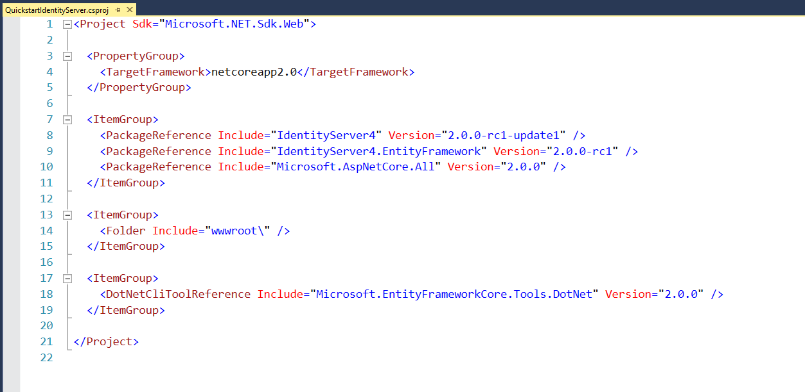
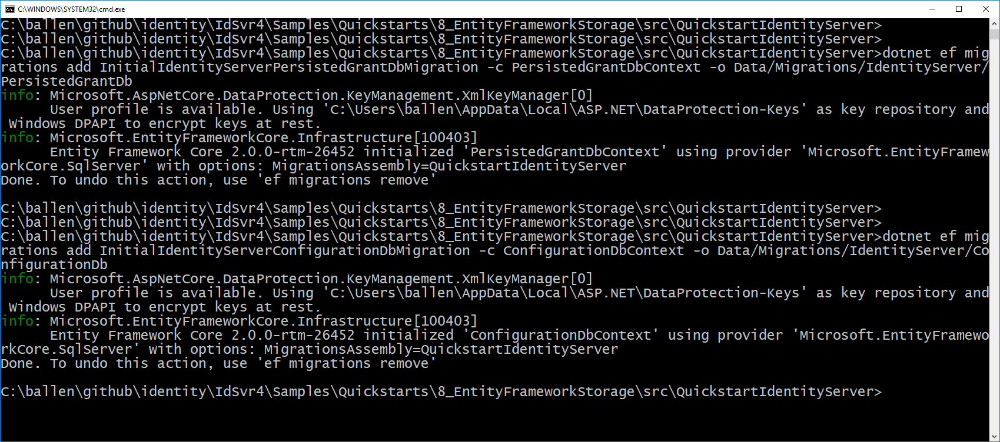

.. _refEntityFrameworkQuickstart:
Using EntityFramework Core for configuration and operational data
=================================================================

IdentityServer is designed for extensibility, and one of the extensibility points is the storage mechanism used for data that IdentityServer needs.
This quickstart shows how to configure IdentityServer to use EntityFramework (EF) as the storage mechanism for this data (rather than using the in-memory implementations we had been using up until now).

.. Note:: In addition to manually configuring EF support, there is also an IdentityServer template to create a new project with EF support. Use ``dotnet new is4ef`` to create it. See `here <https://www.github.com/IdentityServer/IdentityServer4.Templates>`_ for more information.

IdentityServer4.EntityFramework
^^^^^^^^^^^^^^^^^^^^^^^^^^^^^^^

There are two types of data that we are moving to the database. 
The first is the configuration data (resources and clients).
The second is operational data that IdentityServer produces as it's being used (tokens, codes, and consents).
These stores are modeled with interfaces, and we provide an EF implementation of these interfaces in the `IdentityServer4.EntityFramework` Nuget package.

Get started by adding a reference to the `IdentityServer4.EntityFramework` Nuget package the IdentityServer project.

.. image:: images/8_nuget.png

Using SqlServer
^^^^^^^^^^^^^^^

Given EF's flexibility, you can then use any EF-supported database.
For this quickstart we will use the LocalDb version of SqlServer that comes with Visual Studio.

Database Schema Changes and Using EF Migrations
^^^^^^^^^^^^^^^^^^^^^^^^^^^^^^^^^^^^^^^^^^^^^^^

The `IdentityServer4.EntityFramework` package contains entity classes that map from IdentityServer's models.
As IdentityServer's models change, so will the entity classes in `IdentityServer4.EntityFramework.Storage`.
As you use `IdentityServer4.EntityFramework` and upgrade over time, you are responsible for your own database schema and changes necessary to that schema as the entity classes change.
One approach for managing those changes is to use EF migrations, and this quickstart will show how that can be done.
If migrations are not your preference, then you can manage the schema changes in any way you see fit.

.. Note:: SQL scripts for SqlServer are maintained for the entities in `IdentityServer4.EntityFramework.Storage`. They are located `here <https://github.com/IdentityServer/IdentityServer4.EntityFramework.Storage/tree/dev/migrations/SqlServer/Migrations>`_.

EF Tooling for Migrations
^^^^^^^^^^^^^^^^^^^^^^^^^

In addition to tracking schema changes with EF migrations, we will also use it to create the initial schema in the database.
This requires the use of the EF Core tooling (more details `here <https://docs.microsoft.com/en-us/ef/core/miscellaneous/cli/dotnet>`_).
We will add those now, and unfortunately this must be done by hand-editing your `.csproj` file.
To edit the `.csproj` by right-click the project and select "Edit projectname.csproj":

.. Note:: Depending on how you created your initial project for the IdentityServer host, you might already have these tools configured in your `csproj` file. If they are, you can skip to the next section.

.. image:: images/8_edit_csproj.png

And then add the below snippet before the end `</Project>` element::

  <ItemGroup>
    <DotNetCliToolReference Include="Microsoft.EntityFrameworkCore.Tools.DotNet" Version="2.0.0" />
  </ItemGroup>

It should look something like this:

Save and close the file. 
To test that you have the tools properly installed, you can open a command shell in the same directory as the project and run `dotnet ef`.
It should look like this:

.. image:: images/8_dotnet_ef_command_line.png

Configuring the stores
^^^^^^^^^^^^^^^^^^^^^^

The next step is to replace the current calls to ``AddInMemoryClients``, ``AddInMemoryIdentityResources``, and ``AddInMemoryApiResources`` in the ``ConfigureServices`` method in `Startup.cs`.
We will replace them with this code::

    const string connectionString = @"Data Source=(LocalDb)\MSSQLLocalDB;database=IdentityServer4.Quickstart.EntityFramework-2.0.0;trusted_connection=yes;";
    var migrationsAssembly = typeof(Startup).GetTypeInfo().Assembly.GetName().Name;

    // configure identity server with in-memory stores, keys, clients and scopes
    services.AddIdentityServer()
        .AddDeveloperSigningCredential()
        .AddTestUsers(Config.GetUsers())
        // this adds the config data from DB (clients, resources)
        .AddConfigurationStore(options =>
        {
            options.ConfigureDbContext = builder =>
                builder.UseSqlServer(connectionString,
                    sql => sql.MigrationsAssembly(migrationsAssembly));
        })
        // this adds the operational data from DB (codes, tokens, consents)
        .AddOperationalStore(options =>
        {
            options.ConfigureDbContext = builder =>
                builder.UseSqlServer(connectionString,
                    sql => sql.MigrationsAssembly(migrationsAssembly));

            // this enables automatic token cleanup. this is optional.
            options.EnableTokenCleanup = true;
            options.TokenCleanupInterval = 30;
        });

You might need these namespaces added to the file::

    using Microsoft.EntityFrameworkCore;
    using System.Reflection;

The above code is hard-coding a connection string, which you should feel free to change if you wish.
Also, the calls to ``AddConfigurationStore`` and ``AddOperationalStore`` are registering the EF-backed store implementations.

The "builder" callback function passed to these APIs is the EF mechanism to allow you to configure the ``DbContextOptionsBuilder`` for the ``DbContext`` for each of these two stores.
This is how our ``DbContext`` classes can be configured with the database provider you want to use.
In this case by calling ``UseSqlServer`` we are using SqlServer.
As you can also tell, this is where the connection string is provided.

The "options" callback function in ``UseSqlServer`` is what configures the assembly where the EF migrations are defined.
EF requires the use of migrations to define the schema for the database. 

.. Note:: It is the responsibility of your hosting application to define these migrations, as they are specific to your database and provider.

We'll add the migrations next.

Adding migrations
^^^^^^^^^^^^^^^^^

To create the migrations, open a command prompt in the IdentityServer project directory.
In the command prompt run these two commands::

    dotnet ef migrations add InitialIdentityServerPersistedGrantDbMigration -c PersistedGrantDbContext -o Data/Migrations/IdentityServer/PersistedGrantDb
    dotnet ef migrations add InitialIdentityServerConfigurationDbMigration -c ConfigurationDbContext -o Data/Migrations/IdentityServer/ConfigurationDb

It should look something like this:

You should now see a `~/Data/Migrations/IdentityServer` folder in the project. 
This contains the code for the newly created migrations.

.. Note:: If your database project is a separate class library and you fixed the error 'Unable to create an object of type ‘<your-name>DbContext’. Add an implementation of ‘IDesignTimeDbContextFactory’ to the project, or see https://go.microsoft.com/fwlink/?linkid=851728 for additional patterns supported at design time.' by adding implementations of the IDesignTimeDbContextFactory, you will also need implementations of the factory for both the PersistedGrantDbContext as well as the ConfigurationDbContext. 

Initialize the database
^^^^^^^^^^^^^^^^^^^^^^^

Now that we have the migrations, we can write code to create the database from the migrations.
We will also seed the database with the in-memory configuration data that we defined in the previous quickstarts.

In `Startup.cs` add this method to help initialize the database::

    private void InitializeDatabase(IApplicationBuilder app)
    {
        using (var serviceScope = app.ApplicationServices.GetService<IServiceScopeFactory>().CreateScope())
        {
            serviceScope.ServiceProvider.GetRequiredService<PersistedGrantDbContext>().Database.Migrate();

            var context = serviceScope.ServiceProvider.GetRequiredService<ConfigurationDbContext>();
            context.Database.Migrate();
            if (!context.Clients.Any())
            {
                foreach (var client in Config.GetClients())
                {
                    context.Clients.Add(client.ToEntity());
                }
                context.SaveChanges();
            }

            if (!context.IdentityResources.Any())
            {
                foreach (var resource in Config.GetIdentityResources())
                {
                    context.IdentityResources.Add(resource.ToEntity());
                }
                context.SaveChanges();
            }

            if (!context.ApiResources.Any())
            {
                foreach (var resource in Config.GetApiResources())
                {
                    context.ApiResources.Add(resource.ToEntity());
                }
                context.SaveChanges();
            }
        }
    }

And then we can invoke this from the ``Configure`` method::

    public void Configure(IApplicationBuilder app, IHostingEnvironment env, ILoggerFactory loggerFactory)
    {
        // this will do the initial DB population
        InitializeDatabase(app);

        // the rest of the code that was already here
        // ...
    }

Now if you run the IdentityServer project, the database should be created and seeded with the quickstart configuration data.
You should be able to use SQL Server Management Studio or Visual Studio to connect and inspect the data.

.. image:: images/8_database.png

.. Note:: The above ``InitializeDatabase`` helper API is convenient to seed the database, but this approach is not ideal to leave in to execute each time the applicaion runs. Once your database is populated, consider removing the call to the API.

Run the client applications
^^^^^^^^^^^^^^^^^^^^^^^^^^^

You should now be able to run any of the existing client applications and sign-in, get tokens, and call the API -- all based upon the database configuration.

.. Note:: The code as it stands in this section still relies upon Config.cs and its fictitious users Alice and Bob. If your user list is short and static, an adjusted version of Config.cs may suffice, however you may wish to manage a larger and more fluid user list dynamically within a database. ASP.NET Identity is one option to consider, and a sample implementation of this solution is listed among the quickstarts in the next section.
