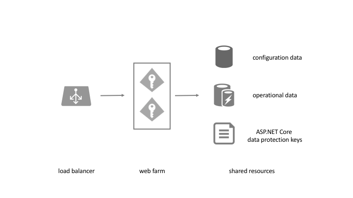

Deployment
==========
Your identity server is `just` a standard ASP.NET Core application including the IdentityServer middleware.
Read the official Microsoft `documentation <https://docs.microsoft.com/en-us/aspnet/core/publishing>`_ on publishing and deployment first
(and especially the `section <https://docs.microsoft.com/en-us/aspnet/core/host-and-deploy/proxy-load-balancer?view=aspnetcore-2.2#scenarios-and-use-cases>`_ about load balancers and proxies).

Typical architecture
^^^^^^^^^^^^^^^^^^^^
Typically you will design your IdentityServer deployment for high availability:

IdentityServer itself is stateless and does not require server affinity - but there is data that needs to be shared between the instances.

Configuration data
^^^^^^^^^^^^^^^^^^
This typically includes:

* resources
* clients
* startup configuration, e.g. key material, external provider settings etc...

The way you store that data depends on your environment. In situations where configuration data rarely changes we recommend using the in-memory stores and code or configuration files.

In highly dynamic environments (e.g. Saas) we recommend using a database or configuration service to load configuration dynamically.

IdentityServer supports code configuration and configuration files (see `here <https://docs.microsoft.com/en-us/aspnet/core/fundamentals/configuration>`_) out of the box.
For databases we provide support for `Entity Framework Core <https://github.com/IdentityServer/IdentityServer4.EntityFramework>`_ based databases.

You can also build your own configuration stores by implementing ``IResourceStore`` and ``IClientStore``.

Key material
^^^^^^^^^^^^

Another important piece of startup configuration is your key material, see :ref:`here <refCrypto>` for more details on key material and cryptography.

Operational data
^^^^^^^^^^^^^^^^
For certain operations, IdentityServer needs a persistence store to keep state, this includes:

* issuing authorization codes
* issuing reference and refresh tokens
* storing consent

You can either use a traditional database for storing operational data, or use a cache with persistence features like Redis.
The EF Core implementation mentioned above has also support for operational data.

You can also implement support for your own custom storage mechanism by implementing ``IPersistedGrantStore`` - by default IdentityServer injects an in-memory version.

ASP.NET Core data protection
^^^^^^^^^^^^^^^^^^^^^^^^^^^^
ASP.NET Core itself needs shared key material for protecting sensitive data like cookies, state strings etc.
See the official docs `here <https://docs.microsoft.com/en-us/aspnet/core/security/data-protection/>`_.

You can either re-use one of the above persistence store or use something simple like a shared file if possible.

ASP.NET Core distributed caching
^^^^^^^^^^^^^^^^^^^^^^^^^^^^^^^^
Some components rely on ASP.NET Core distributed caching. In order to work in a multi server environment, this needs to be set up correctly. 
The `official docs <https://docs.microsoft.com/en-us/aspnet/core/performance/caching/distributed/>`_ describe several options.

The following components rely on ``IDistributedCache``:

* ``services.AddOidcStateDataFormatterCache()`` configures the OpenIdConnect handlers to persist the state parameter into the server-side ``IDistributedCache``.
* ``DefaultReplayCache``
* ``DistributedDeviceFlowThrottlingService``
* ``DistributedCacheAuthorizationParametersMessageStore``
