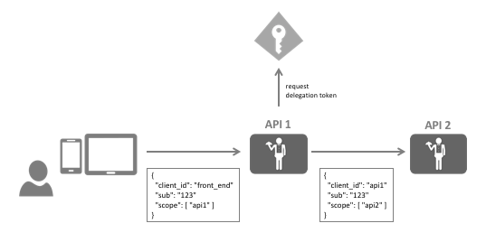

.. _refExtensionGrants:
Extension Grants
================

OAuth 2.0 defines standard grant types for the token endpoint, such as ``password``, ``authorization_code`` and ``refresh_token``. Extension grants are a way to add support for non-standard token issuance scenarios like token translation, delegation, or custom credentials.

You can add support for additional grant types by implementing the ``IExtensionGrantValidator`` interface::

    public interface IExtensionGrantValidator
    {
        /// 

        /// Handles the custom grant request.
        /// 

        /// <param name="request">The validation context.</param>
        Task ValidateAsync(ExtensionGrantValidationContext context);

        /// 

        /// Returns the grant type this validator can deal with
        /// 

        /// <value>
        /// The type of the grant.
        /// </value>
        string GrantType { get; }
    }

The ``ExtensionGrantValidationContext`` object gives you access to:

* the incoming token request - both the well-known validated values, as well as any custom values (via the ``Raw`` collection)
* the result - either error or success
* custom response parameters

To register the extension grant, add it to DI::

    builder.AddExtensionGrantValidator<MyExtensionsGrantValidator>();

Example: Simple delegation using an extension grant
^^^^^^^^^^^^^^^^^^^^^^^^^^^^^^^^^^^^^^^^^^^^^^^^^^^
Imagine the following scenario - a front end client calls a middle tier API using a token acquired via an interactive flow (e.g. hybrid flow).
This middle tier API (API 1) now wants to call a back end API (API 2) on behalf of the interactive user:

In other words, the middle tier API (API 1) needs an access token containing the user's identity, but with the scope of the back end API (API 2).

.. note:: You might have heard of the term *poor man's delegation* where the access token from the front end is simply forwarded to the back end. This has some shortcomings, e.g. *API 2* must now accept the *API 1* scope which would allow the user to call *API 2* directly. Also - you might want to add some delegation specific claims into the token, e.g. the fact that the call path is via *API 1*.

**Implementing the extension grant**

The front end would send the token to API 1, and now this token needs to be exchanged at IdentityServer with a new token for API 2.

On the wire the call to token service for the exchange could look like this::

    POST /connect/token

    grant_type=delegation&
    scope=api2&
    token=...&
    client_id=api1.client
    client_secret=secret

It's the job of the extension grant validator to handle that request by validating the incoming token, and returning a result that represents the new token::

    public class DelegationGrantValidator : IExtensionGrantValidator
    {
        private readonly ITokenValidator _validator;

        public DelegationGrantValidator(ITokenValidator validator)
        {
            _validator = validator;
        }

        public string GrantType => "delegation";

        public async Task ValidateAsync(ExtensionGrantValidationContext context)
        {
            var userToken = context.Request.Raw.Get("token");

            if (string.IsNullOrEmpty(userToken))
            {
                context.Result = new GrantValidationResult(TokenRequestErrors.InvalidGrant);
                return;
            }

            var result = await _validator.ValidateAccessTokenAsync(userToken);
            if (result.IsError)
            {
                context.Result = new GrantValidationResult(TokenRequestErrors.InvalidGrant);
                return;
            }

            // get user's identity
            var sub = result.Claims.FirstOrDefault(c => c.Type == "sub").Value;

            context.Result = new GrantValidationResult(sub, GrantType);
            return;
        }
    }

Don't forget to register the validator with DI.

**Registering the delegation client**

You need a client registration in IdentityServer that allows a client to use this new extension grant, e.g.::

    var client = new client
    {
        ClientId = "api1.client",
        ClientSecrets = new List<Secret>
        {
            new Secret("secret".Sha256())
        },
        
        AllowedGrantTypes = { "delegation" },

        AllowedScopes = new List<string>
        {
            "api2"
        }
    }

**Calling the token endpoint**

In API 1 you can now construct the HTTP payload yourself, or use the *IdentityModel* helper library::

    public async Task<TokenResponse> DelegateAsync(string userToken)
    {
        var client = _httpClientFactory.CreateClient();
        // or 
        // var client = new HttpClient();

        // send custom grant to token endpoint, return response
        return await client.RequestTokenAsync(new TokenRequest
        {
            Address = disco.TokenEndpoint,
            GrantType = "delegation",

            ClientId = "api1.client",
            ClientSecret = "secret",

            Parameters =
            {
                { "scope", "api2" },
                { "token", userToken}
            }                
        });
    }

The ``TokenResponse.AccessToken`` will now contain the delegation access token.
