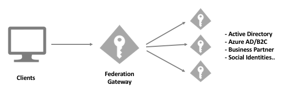

Federation Gateway
==================

A common architecture is the so-called federation gateway. In this approach IdentityServer acts as a gateway to one or more external identity providers.

This architecture has the following advantages

* your applications only need to know about the one token service (the gateway) and are shielded from all the details about connecting to the external provider(s). This also means that you can add or change those external providers without needing to update your applications.
* you control the gateway (as opposed to some external service provider) - this means you can make any changes to it and can protect your applications from changes those external providers might do to their own services.
* most external providers only support a fixed set of claims and claim types - having a gateway in the middle allows post-processing the response from the providers to transform/add/amend domain specific identity information.
* some providers don't support access tokens (e.g. social providers) - since the gateway knows about your APIs, it can issue access tokens based on the external identities.
* some providers charge by the number of applications you connect to them. The gateway acts as a single application to the external provider. Internally you can connect as many applications as you want.
* some providers use proprietary protocols or made proprietary modifications to standard protocols - with a gateway there is only one place you need to deal with that.
* forcing every authentication (internal or external) through one single place gives you tremendous flexibility with regards to identity mapping, providing a stable identity to all your applications and dealing with new requirements

In other words - owning your federation gateway gives you a lot of control over your identity infrastructure. And since the identity of your users is one of your most important assets, we recommend taking control over the gateway.

Implementation
^^^^^^^^^^^^^^
Our `quick start UI <https://github.com/IdentityServer/IdentityServer4.Quickstart.UI>`_ utilizes some of the below features. Also check out the :ref:`external authentication quickstart <refExternalAuthenticationQuickstart>` and the 
docs about :ref:`external providers <refExternalIdentityProviders>`.

* You can add support for external identity providers by adding authentication handlers to your IdentityServer application.
* You can programmatically query those external providers by calling ``IAuthenticationSchemeProvider``. This allows to dynamically render your login page based on the registered external providers.
* Our client configuration model allows restricting the available providers on a per client basis (use the ``IdentityProviderRestrictions`` property).
* You can also use the ``EnableLocalLogin`` property on the client to tell your UI whether the username/password input should be rendered.
* Our quickstart UI funnels all external authentication calls through a single callback (see ``ExternalLoginCallback`` on the ``AccountController`` class). This allows for a single point for post-processing.
