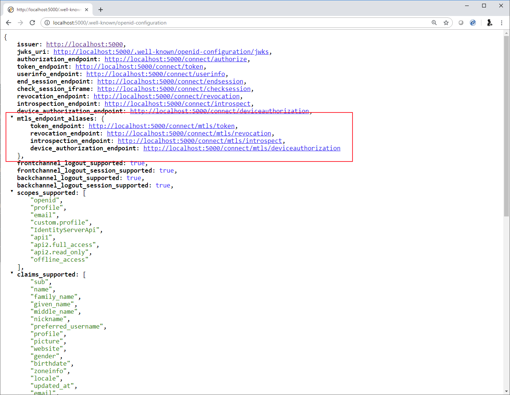
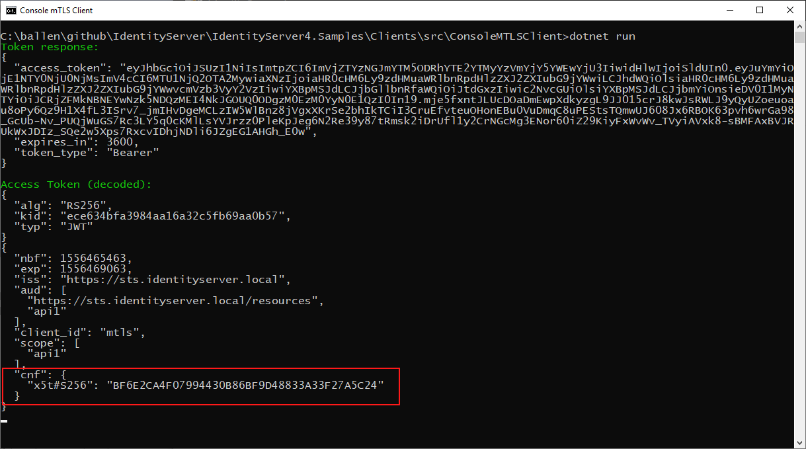

.. _refMutualTLS:
Mutual TLS
==========
Mutual TLS support in IdentityServer allows for two features:

* Client authentication to endpoints within IdentityServer using a X.509 client certificate
* Use of sender-constrained access tokens from a client to APIs using a X.509 client certificate certificate

.. Note:: See `this <https://tools.ietf.org/wg/oauth/draft-ietf-oauth-mtls/>`_ spec for more information

Client authentication
^^^^^^^^^^^^^^^^^^^^^
Clients can use a X.509 client certificate as an authentication mechanism to endpoints in IdentityServer.

Validating the X.509 client certificate in IdentityServer
~~~~~~~~~~~~~~~~~~~~~~~~~~~~~~~~~~~~~~~~~~~~~~~~~~~~~~~~~
It's the hosting layer's responsibility to do the actual validation of the client certificate, 
and then IdentityServer uses (and trusts) this result as part of the client authentication and validation at the application level.
This means to use this feature within IdentityServer you must first configure your web server (IIS, Kestrel, Nginx etc.) to accept and validate client certificates.

Consult your web server documentation to learn how to do this.

.. Note:: `mkcert <https://github.com/FiloSottile/mkcert>`_ is a nice utility for creating certificates for development purposes.

Endpoints in IdentityServer for mutual TLS
~~~~~~~~~~~~~~~~~~~~~~~~~~~~~~~~~~~~~~~~~~
Given that mutual TLS is performed at the TLS channel, you need to isolate the client certificate requirements and validation rules 
to distinct endpoints where mutual TLS is expected and/or required.
This allows the existing endpoints in IdentityServer to operate normally without mutual TLS.

In IdentityServer, the mutual TLS endpoints, can be configured in three ways (assuming IdentityServer is running on ``https://identityserver.io``:

* path-based - endpoints located beneath the path ``~/connect/mtls``, e.g. ``https://identityserver.io/connect/mtls/token``.
* sub-domain based - endpoints are on a sub-domain of the main server, e.g. ``https://mtls.identityserver.io/connect/token``.
* domain-based - endpoints are on a different domain, e.g. ``https://identityserver-mtls.io``.  

IdentityServer's discovery document reflects those endpoints:

Mutual TLS configuration in IdentityServer
~~~~~~~~~~~~~~~~~~~~~~~~~~~~~~~~~~~~~~~~~~
IdentityServer requires additional configuration to utilize the result of the mutual TLS authentication. 

First, there must be an authentication handler configured in the hosting application that will surface the result of the client certificate authentication in the web server.
ASP.NET 3.0 includes such a handler in the ``Microsoft.AspNetCore.Authentication.Certificate`` nuget package::

    services.AddAuthentication()
        .AddCertificate("Certificate", options =>
        {
            // allows both self-signed and CA-based certs. Check the MTLS spec for details.
            options.AllowedCertificateTypes = CertificateTypes.All;
        });

See `here <https://docs.microsoft.com/en-us/aspnet/core/security/authentication/certauth?view=aspnetcore-3.1>`_ for more information on how to configure
the certificate handler.

Next, in the :ref:`IdentityServer options <refOptions>`, enable mutual TLS and configure the scheme of the authentication handler registered in the previous step.

For example::

    var builder = services.AddIdentityServer(options =>
    {
        options.MutualTls.Enabled = true;
        options.MutualTls.ClientCertificateAuthenticationScheme = "Certificate";
    });

With the above configuration, IdentityServer will now trigger certificate validation when a request comes in on one of the configured endpoint variations (path or domain-based).

The next step is to associate the client certificate with a client in IdentityServer.
Use the :ref:`IdentityServer builder <refStartup>` to add the services to DI which contain a default implementation to do that either thumbprint or common-name based::

    builder.AddMutualTlsSecretValidators();

Finally, for the :ref:`client configuration <refClient>` add to the ``ClientSecrets`` collection a secret type of either ``SecretTypes.X509CertificateName`` if you wish to authenticate the client from the certificate distinguished name or ``SecretTypes.X509CertificateThumbprint`` if you wish to authenticate the client by certificate thumbprint.
For example::

    new Client
    {
        ClientId = "mtls",
        AllowedGrantTypes = GrantTypes.ClientCredentials,
        AllowedScopes = { "api1" }
        ClientSecrets = 
        {
            // name based
            new Secret(@"CN=mtls.test, OU=ROO\ballen@roo, O=mkcert development certificate", "mtls.test")
            {
                Type = SecretTypes.X509CertificateName
            },
            // or thumbprint based
            //new Secret("bca0d040847f843c5ee0fa6eb494837470155868", "mtls.test")
            //{
            //    Type = SecretTypes.X509CertificateThumbprint
            //},
        },
    }

Using a client certificate to authenticate to IdentityServer
~~~~~~~~~~~~~~~~~~~~~~~~~~~~~~~~~~~~~~~~~~~~~~~~~~~~~~~~~~~~
When writing a client to connect to IdentityServer, the ``SocketsHttpHandler`` (or ``HttpClientHandler`` if you are on older .NET Framework versions) 
class provides a convenient mechanism to add a client certificate to outgoing requests.

And then HTTP calls (including using the various `IdentityModel <https://github.com/IdentityModel/IdentityModel2>`_ extension methods) with the ``HttpClient`` 
will perform client certificate authentication at the TLS channel.

For example::

    static async Task<TokenResponse> RequestTokenAsync()
    {
        var handler = new SocketsHttpHandler();
        var cert = new X509Certificate2("client.p12", "password");
        handler.SslOptions.ClientCertificates = new X509CertificateCollection { cert };

        var client = new HttpClient(handler);

        var disco = await client.GetDiscoveryDocumentAsync(Constants.Authority);
        if (disco.IsError) throw new Exception(disco.Error);

        var response = await client.RequestClientCredentialsTokenAsync(new ClientCredentialsTokenRequest
        {
            Address = disco
                            .TryGetValue(OidcConstants.Discovery.MtlsEndpointAliases)
                            .Value<string>(OidcConstants.Discovery.TokenEndpoint)
                            .ToString(),
                            
            ClientId = "mtls",
            Scope = "api1"
        });

        if (response.IsError) throw new Exception(response.Error);
        return response;
    }

Sender-constrained access tokens
^^^^^^^^^^^^^^^^^^^^^^^^^^^^^^^^
Whenever a client authenticates to IdentityServer using a client certificate, the thumbrint of that certificate will be embedded in the access token.

Clients can use a X.509 client certificate as a mechanism for sender-constrained access tokens when authenticating to APIs.
The use of these sender-constrained access tokens requires the client to use the same X.509 client certificate to authenticate to the API as the one used for IdentityServer.

Confirmation claim
~~~~~~~~~~~~~~~~~~
When a client obtains an access token and has authenticated with mutual TLS, IdentityServer issues a confirmation claim (or ``cnf``) in the access token.
This value is a hash of the thumbprint of the client certificate used to authenticate with IdentityServer.

This value can be seen in this screen shot of a decoded access token:

.. note:: This feature can be also enabled for other authentication methods (e.g. shared secrets) by setting ``AlwaysEmitConfirmationClaim`` to ``true`` on the MTLS options. 

The API will then use this value to ensure the client certificate being used at the API matches the confirmation value in the access token.

Validating and accepting a client certificate in APIs
~~~~~~~~~~~~~~~~~~~~~~~~~~~~~~~~~~~~~~~~~~~~~~~~~~~~~
As mentioned above for client authentication in IdentityServer, in the API the web server is expected to perform the client certificate validation at the TLS layer.

Aditionally, the API hosting application will need a mechanism to accept the client certificate in order to obtain the thumbprint to perform the confirmation claim validation.
Below is an example how an API in ASP.NET Core might be configured for both access tokens and client certificates::

    services.AddAuthentication("token")
        .AddIdentityServerAuthentication("token", options =>
        {
            options.Authority = Constants.Authority;
            options.ApiName = "api1";

        })
        .AddCertificate(options =>
        {
            options.AllowedCertificateTypes = CertificateTypes.All;
        });

Finally, a mechanism is needed that runs after the authentication middleware to authenticate the client certificate and compare the thumbprint to the ``cnf`` from the access token.

Below is an example implemented in middleware::

    app.UseAuthentication();

    app.Use(async (ctx, next) =>
    {
        if (ctx.User.Identity.IsAuthenticated)
        {
            var cnfJson = ctx.User.FindFirst("cnf")?.Value;
            if (!String.IsNullOrWhiteSpace(cnfJson))
            {
                var certResult = await ctx.AuthenticateAsync("Certificate");
                if (!certResult.Succeeded)
                {
                    await ctx.ChallengeAsync("Certificate");
                    return;
                }

                var cert = ctx.Connection.ClientCertificate;
                if (cert == null)
                {
                    await ctx.ChallengeAsync("Certificate");
                    return;
                }

                var thumbprint = cert.Thumbprint;

                var cnf = JObject.Parse(cnfJson);
                var sha256 = cnf.Value<string>("x5t#S256");

                if (String.IsNullOrWhiteSpace(sha256) ||
                    !thumbprint.Equals(sha256, StringComparison.OrdinalIgnoreCase))
                {
                    await ctx.ChallengeAsync("token");
                    return;
                }
            }
        }

        await next();
    });

Once the above middlware succeeds, then the caller has been authenticated with a sender-constrained access token.

Introspection and the confirmation claim
~~~~~~~~~~~~~~~~~~~~~~~~~~~~~~~~~~~~~~~~
When the access token is a JWT, then the confirmation claim is contained in the token as a claim.
When using reference tokens, the claims that the access token represents must be obtained via introspection.
The introspection endpoint in IdentityServer will return a ``cnf`` claim for reference tokens obtained via mutual TLS.
