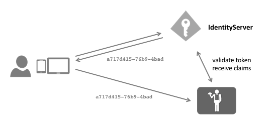

Reference Tokens
================
Access tokens can come in two flavours - self-contained or reference.

A JWT token would be a self-contained access token - it's a protected data structure with claims and an expiration.
Once an API has learned about the key material, it can validate self-contained tokens without needing to communicate with the issuer.
This makes JWTs hard to revoke. They will stay valid until they expire.

When using reference tokens - IdentityServer will store the contents of the token in a data store and will only issue a unique identifier for this token back to the client.
The API receiving this reference must then open a back-channel communication to IdentityServer to validate the token.

You can switch the token type of a client using the following setting::

    client.AccessTokenType = AccessTokenType.Reference;

IdentityServer provides an implementation of the OAuth 2.0 introspection specification which allows APIs to dereference the tokens.
You can either use our dedicated `introspection handler <https://github.com/IdentityModel/IdentityModel.AspNetCore.OAuth2Introspection>`_
or use the `identity server authentication handler <https://github.com/IdentityServer/IdentityServer4.AccessTokenValidation>`_ which can validate both JWTs and reference tokens.

The introspection endpoint requires authentication - since the client of an introspection endpoint is an API, you configure the secret on the ``ApiResource``::

    var api = new ApiResource("api1")
    {
        ApiSecrets = { new Secret("secret".Sha256()) }
    }

See :ref:`here <refProtectingApis>` for more information on how to configure the IdentityServer authentication middleware for APIs.
