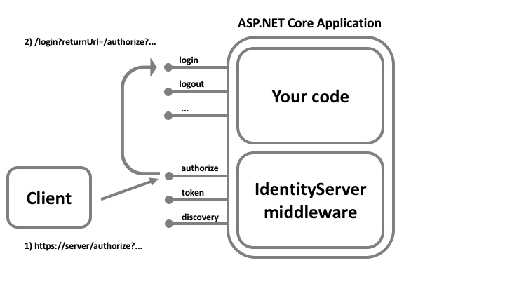

.. _refSignIn:
Sign-in
=======

In order for IdentityServer to issue tokens on behalf of a user, that user must sign-in to IdentityServer.

Cookie authentication
^^^^^^^^^^^^^^^^^^^^^
Authentication is tracked with a cookie managed by the `cookie authentication <https://docs.microsoft.com/en-us/aspnet/core/security/authentication/cookie>`_ handler from ASP.NET Core.
You can register the cookie handler yourself, or you can use the one that IdentityServer automatically registers.
IdentityServer uses whichever cookie handler that matches the ``DefaultAuthenticateScheme`` as configured on the ``AuthenticationOptions`` when using ``AddAuthentication`` from ASP.NET Core.

Overriding cookie handler configuration
^^^^^^^^^^^^^^^^^^^^^^^^^^^^^^^^^^^^^^^

If you wish to use your own cookie authentication handler (typically to change the default settings), then you must configure it yourself.
This must be done in ``ConfigureServices`` after registering IdentityServer in DI (with ``AddIdentityServer``).
For example::

    services.AddIdentityServer()
        .AddInMemoryClients(Clients.Get())
        .AddInMemoryIdentityResources(Resources.GetIdentityResources())
        .AddInMemoryApiResources(Resources.GetApiResources())
        .AddDeveloperSigningCredential()
        .AddTestUsers(TestUsers.Users);

    services.AddAuthentication("MyCookie")
        .AddCookie("MyCookie", options =>
        {
            options.ExpireTimeSpan = ...;
        });

.. note:: IdentityServer internally calls both ``AddAuthentication`` and ``AddCookie`` with a custom scheme (via the constant ``IdentityServerConstants.DefaultCookieAuthenticationScheme``), so to override them you must make the same calls after ``AddIdentityServer``.

Login User Interface and Identity Management System
^^^^^^^^^^^^^^^^^^^^^^^^^^^^^^^^^^^^^^^^^^^^^^^^^^^
IdentityServer does not provide any user-interface or user database for authentication.
These are things you are expected to provide or develop yourself.
We have samples that use :ref:`ASP.NET Identity <refAspNetIdentityQuickstart>`.

We also have a `quickstart UI <https://github.com/IdentityServer/IdentityServer4.Quickstart.UI>`_ that has basic implementations of all the moving parts like login, consent and logout as a starting point.

Login Workflow
^^^^^^^^^^^^^^
When IdentityServer receives a request at the authorization endpoint and the user is not authenticated, the user will be redirected to the configured login page.
You must inform IdentityServer of the path to your login page via the ``UserInteraction`` settings on the :ref:`options <refOptions>`.
A ``returnUrl`` parameter will be passed informing your login page where the user should be redirected once login is complete.

.. Note:: Beware `open-redirect attacks <https://en.wikipedia.org/wiki/URL_redirection#Security_issues>`_ via the ``returnUrl`` parameter. You should validate that the ``returnUrl`` refers to well-known location. See the :ref:`interaction service <refInteractionService>` for APIs to validate the ``returnUrl`` parameter.

Login Context
^^^^^^^^^^^^^
On your login page you might require information about the context of the request in order to customize the login experience 
(such as client, prompt parameter, IdP hint, or something else).
This is made available via the ``GetAuthorizationContextAsync`` API on the the :ref:`interaction service <refInteractionService>`.

Issuing a cookie and Claims
^^^^^^^^^^^^^^^^^^^^^^^^^^^^^^^^
There are authentication-related extension methods on the ``HttpContext`` from ASP.NET Core to issue the authentication cookie and sign a user in. 
The authentication scheme used must match the cookie handler you are using (see above).

When you sign the user in you must issue at least a ``sub`` claim and a ``name`` claim.
IdentityServer also provides a few ``SignInAsync`` extension methods on the ``HttpContext`` to make this more convenient.

You can also optionally issue an ``idp`` claim (for the identity provider name), an ``amr`` claim (for the authentication method used), and/or an ``auth_time`` claim (for the epoch time a user authenticated).
If you do not provide these, then IdentityServer will provide default values.
